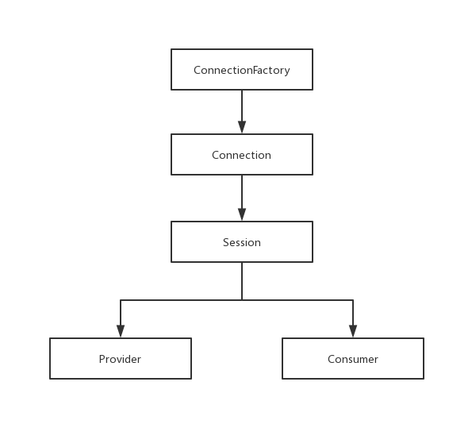
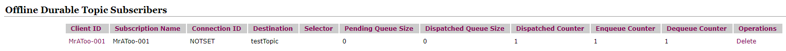

相信大家遇到过这样的场景，用户注册这个简单的功能里面集成了太多不是很重要步骤，但又不得不做。比如发送邮件、发放优惠券、发送推销短信、记录日志，这样就导致了我们注册功能特别繁重，
极大的拉低了接口性能，给用户带来体验度大大降低，明明就一个注册用户信息持久化的功能居然需要做这么多不是主线流程的事情。当你遇到这样的业务场景的时候就可以考虑使用消息队列来实现
解耦，经过优化过后，我们的注册功能就只需要将用户信息持久化到数据库，然后小MQ中间件发送一条消息，然后返回，如果说之前的每个操作需要一秒，那总得就需要5S，但是经过使用MQ解耦过后
只需要1S左右，大大提升了用户体验。

## JMS
JMS(Java Message Service)是Java为各个消息中间件提供的一套统一API规范，其目的是规避各个中间件协议、接口的不同而带来的不便。一下是JMS连接流程图：

### 消息传递模式
JMS提供两种常见的消息传递模式或域，分别是：
* P2P(点对点的消息传递模式):一个消息生成者对应一个消费者，两者之间不存在时间上的相关性（即，就算消费者不在线，生产者照样可以发送消息到`Broker`上，等消费者上线过后继续消费）
* PUB/SUB(发布订阅的消息传递模式):一个消息生产者对应多个消息消费者，两者之间存在时间上的相关性（即，消费者只能收到订阅过后并且在线时生产者发送的消息，但不是绝对，JMS允许
消费者创建持久化订阅，持久订阅允许消费者消费他不在线时发送的消息）

### 消息类型或结构组成
消息的结构由消息头、消息体、属性组成
* 消息头：消息头包含消息识别和路由信息
* 消息体：一般是我们发送的消息内容
* 消息属性：属性分为应用设置的属性、标准属性、中间件定义的属性
JMS提供六种消息类型，分别是：
* TextMessage:文本消息
* MapMessage:键值对消息，键是String类型，值可以是Java的任何类型
* BytesMessage:字节流消息
* StreamMessage:输入输出流消息
* ObjectMessage:可序列化对象消息
* Message:空消息，不包含有消息体，只有消息头和属性

## ActiveMQ
### 安装

* [下载](http://www.apache.org/dyn/closer.cgi?filename=/activemq/5.15.10/apache-activemq-5.15.10-bin.tar.gz&action=download)
* 解压:`tar -zxvf apache-activemq-5.15.9-bin.tar.gz`
* 启动:`sh activemq start`
* 访问:[http://localhost:8161](http://localhost:8161)

### JMS API调用过程

### P2P(Queue)消息传递方式

* 消息生产者
```java
public class QueueProvider {
    public static void main(String[] args) throws JMSException {
        //创建连接工厂
        ConnectionFactory connectionFactory = new ActiveMQConnectionFactory("tcp://192.168.3.224:61616");
        //创建连接
        Connection connection = connectionFactory.createConnection();
        //建立连接
        connection.start();
        //创建会话
        Session session = connection.createSession(Boolean.TRUE, Session.AUTO_ACKNOWLEDGE);
        //创建目的地
        Destination destination = new ActiveMQQueue("testQueue");
        //创建消息生产者
        MessageProducer producer = session.createProducer(destination);
        //创建消息
        TextMessage message = new ActiveMQTextMessage();
        message.setText("Hello World");
        //发送消息
        producer.send(message);
        //提交消息事务，该方法只有在事务型会话时使用
        session.commit();
        //关闭会话
        session.close();
        //关闭连接
        connection.close();
    }
}
```

* 消息消费者
```java
public class QueueConsumer {
    public static void main(String[] args) throws JMSException {
        //创建连接工厂
        ConnectionFactory connectionFactory = new ActiveMQConnectionFactory("tcp://192.168.3.224:61616");
        //创建连接
        Connection connection = connectionFactory.createConnection();
        //建立连接
        connection.start();
        //创建会话
        Session session = connection.createSession(Boolean.TRUE, Session.AUTO_ACKNOWLEDGE);
        //创建目的地
        Destination destination = new ActiveMQQueue("testQueue");
        //创建消费者
        MessageConsumer consumer = session.createConsumer(destination);
        //消费消息
        TextMessage message = (TextMessage)consumer.receive();
        //输出消息（处理消息）
        System.out.println(message.getText());
        //确认消息，该方法只有在事务型会话时使用
        session.commit();
        //关闭会话
        session.close();
        //关闭连接
        connection.close();
    }
}
```
消息消费还可以使用监听器的方式，代码如下(片段)：
```java
//...
//创建消费者
MessageConsumer consumer = session.createConsumer(destination);
MessageListener messageListener = new MessageListener() {
    public void onMessage(Message message) {
        TextMessage textMessage = (TextMessage) message;
        System.out.println(textMessage);
    }
};
//设置消息监听
consumer.setMessageListener(messageListener);
//确认消息，该方法只有在事务型会话时使用
session.commit();
//...
```

### PUB/SUB(发布/订阅)消息传递方式

* 消息生产者
```java
public class TopicProvider {
    public static void main(String[] args) throws JMSException {
        //创建连接工厂
        ConnectionFactory connectionFactory = new ActiveMQConnectionFactory("tcp://192.168.3.224:61616");
        //创建连接
        Connection connection = connectionFactory.createConnection();
        //建立连接
        connection.start();
        //创建会话
        Session session = connection.createSession(Boolean.TRUE, Session.AUTO_ACKNOWLEDGE);
        //创建目的地
        Destination destination = new ActiveMQTopic("testTopic");
        //创建消息生产者
        MessageProducer producer = session.createProducer(destination);
        //创建消息
        TextMessage message = new ActiveMQTextMessage();
        message.setText("Hello World");
        //发送消息
        producer.send(message);
        //提交消息事务，该方法只有在事务型会话时使用
        session.commit();
        //关闭会话
        session.close();
        //关闭连接
        connection.close();
    }
}
```

* 消息消费者
```java
public class TopicConsumer {
    public static void main(String[] args) throws JMSException {
        //创建连接工厂
        ConnectionFactory connectionFactory = new ActiveMQConnectionFactory("tcp://192.168.3.224:61616");
        //创建连接
        Connection connection = connectionFactory.createConnection();
        //建立连接
        connection.start();
        //创建会话
        Session session = connection.createSession(Boolean.TRUE, Session.AUTO_ACKNOWLEDGE);
        //创建目的地
        Destination destination = new ActiveMQTopic("testTopic");
        //创建消费者
        MessageConsumer consumer = session.createConsumer(destination);
        //消费消息
        TextMessage message = (TextMessage)consumer.receive();
        //输出消息（处理消息）
        System.out.println(message.getText());
        //确认消息，该方法只有在事务型会话时使用
        session.commit();
        //关闭会话
        session.close();
        //关闭连接
        connection.close();
    }
}
```
前面讲到JMS允许消费者创建持久化订阅，持久订阅允许消费者消费他不在线时发送的消息，实现这一需求需要改动消费者三个地方，分别是：
```java
public class TopicConsumer {
    public static void main(String[] args) throws JMSException {
        //创建连接工厂
        ConnectionFactory connectionFactory = new ActiveMQConnectionFactory("tcp://192.168.3.224:61616");
        //创建连接
        Connection connection = connectionFactory.createConnection();
        //配置客户端ID
        connection.setClientID("MrAToo-001");//[1]
        //建立连接
        connection.start();
        //创建会话
        Session session = connection.createSession(Boolean.TRUE, Session.AUTO_ACKNOWLEDGE);
        //创建目的地
        Topic destination = new ActiveMQTopic("testTopic");//[2]
        //创建消费者
        MessageConsumer consumer = session.createDurableSubscriber(destination,"MrAToo-001");//[3]
        //消费消息
        TextMessage message = (TextMessage)consumer.receive();
        //输出消息（处理消息）
        System.out.println(message.getText());
        //确认消息，该方法只有在事务型会话时使用
        session.commit();
        //关闭会话
        session.close();
        //关闭连接
        connection.close();
    }
}
```

* 标注[1]:`connection.setClientID("MrAToo-001");`为客户的设置一个ID
* 标注[2]:`Topic destination = new ActiveMQTopic("testTopic");`接受参数使用`Destination`的子类`Topic`
* 标注[3]:`MessageConsumer consumer = session.createDurableSubscriber(destination,"MrAToo-001");`调用`session.createDurableSubscriber`方法

通过上面的配置，在`Broker`上会存在一条客户端记录


## JMS消息的可靠方式
正常情况下，消息消费有三个阶段：消息接收、消息处理、消息确认，在消息在被收到处理完毕并且确认过后被视为消息被成功消费。

### 事务型会话
在事务型会话中，消息生产者和消息消费者均需要调用`session.commit`方法，对于生产者而言，`commit`表示消息提交，只有提交的消息才会存在`Broker`中，才能被消费者消费
对于消费者而言，`commit`表示消息被确认，只有被确认的消息，`Broker`才不会再次重发消息，很大程度上能避免消息重发的问题（但是并不能正在意义上解决消息的重复消费）。
相反的还有`session.rollback`，该方法表示对之前做的所有操作进行作废处理，对于生成者而言，已经发送的消息回滚。对于消费者而言，当前消息标记为未接受，`Broker`会重发消息。
> 注意：必须保证生产者和消费者都是事务型会话

### 非事务型会话
在非事务型会话中，消息何时被确认取决于创建会话时的应答模式(acknowledgement mode)，应答模式有三种：
* Session.AUTO_ACKNOWLEDGE(自动确认):消息在被收到时自动确认消息
* Session.CLIENT_ACKNOWLEDGE(手动确认):消费者在收到消息过后，处理完毕通过手动调用`message.acknowledge();`进行手动确认，需要注意的是：该方法确认该会话中所有被处理的消息。
* Session.DUPS_ACKNOWLEDGE(消息延迟确认):该选择只是会话迟钝的确认消息的提交

## 消息的持久化存储

### 非持久化
该模式不会讲消息存储到可靠的存储介质中（例如：磁盘，DB），只会存在于内存中，如果`Broker`出现宕机，则消息会丢失

### 持久化
该模式会将生产者发送到`Broker`的消息持久化到可靠存储介质中，即使是`Broker`出现宕机，也不会出现消息丢失的情况，但是，由于生产者或者消费者在发送或者确认消息的过程中，
`Broker`需要将消息从可靠存储介质中保存或者删除，从来带来了IO开销，性能上比非持久化存储方式相对来说较低

## 持久化消息和非持久化消息的发送策略

### 消息的同步发送和异步发送

同步发送：消息生产者发送一条消息到`Broker`上，会被阻塞

## 消息发送原理分析

## 持久化消息和非持久化消息的存储原理

### 持久化消息的物种存储方式
* KahaDB
* JDBC
* LevelDB
* Memory
* JDBC With ActiveMQ Journal

## 消息消费原理分析

## unconsumedMessages数据获取过程

## 异步分发流程

## prefetchSize与optimizeAcknowledge

## 消息的确认过程

## 消息的重发机制

## 死信队列

## ActiveMQ静态网络配置