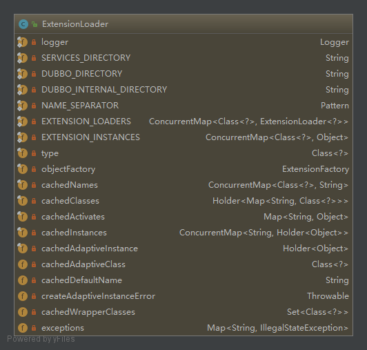

## Dubbo SPI
### Dubbo SPI使用以及规范
* 创建接口并且加上@SPI注解表示该接口是一个Dubbo扩展点，将该扩展点打成一个jar包发布
```java
@SPI
public interface IHelloService {
    String sayHello(String msg);
}
```
* 在需要实现的扩展插件项目中依赖以上接口扩展点，并且实现该接口扩展点
```java
public class HelloServiceImpl implements IHelloService {
    @Override
    public String sayHello(String msg) {
        return "Dubbo SPI Hello:" + msg;
    }
}
```
并且在resources目录先创建META-INF/dubbo/(META-INF/dubbo/;META-INF/dubbo/internal/;META-INF/services/;任选一个)目录，并且在该目录下创建以扩展点接口为名称的文件：xyz.easyjava.dubbo.spi.extend.service.IHelloService
在该文件中填写该扩展点实现的名称以及实现类的全路径，例如：
```java
hello=xyz.easyjava.dubbo.spi.achieve.service.HelloServiceImpl
hello2=xyz.easyjava.dubbo.spi.achieve.service.HelloServiceImpl2
```
* 现在就可以在需要使用该扩展的地方使用了，方式如下：
```java
public class DubboSpiTest {
    public static void main(String[] args) {
        IHelloService extension = ExtensionLoader.getExtensionLoader(IHelloService.class).getExtension("hello2");
        System.out.println(extension.sayHello("MrAToo"));
        IHelloService adaptiveExtension = ExtensionLoader.getExtensionLoader(IHelloService.class).getAdaptiveExtension();
        System.out.println(adaptiveExtension.sayHello("MrAToo2"));
    }
}
```

### 源码分析
先从`ExtensionLoader.getExtensionLoader(IHelloService.class).getAdaptiveExtension();`开始
1. 首先是调用了`ExtensionLoader`类的静态方法`getExtensionLoader(IHelloService.class)`，在该方法中除了校验，主要是实例化了一个`ExtensionLoader`实例，
并且在`ExtensionLoader`的构造方法中通过`objectFactory = (type == ExtensionFactory.class ? null : ExtensionLoader.getExtensionLoader(ExtensionFactory.class).getAdaptiveExtension());`
创建了一个`objectFactory`对象，该对象是一个`ExtensionFactory`
2. 得到`ExtensionLoader`实例对象过后，调用了该对象的`getAdaptiveExtension()`方法，在该方法中调用`createAdaptiveExtension()`创建实例，在`createAdaptiveExtension()`里面调用
`injectExtension((T) getAdaptiveExtensionClass().newInstance());`，该方法是一个注入的方法，先不看`injectExtension()`方法是如何注入的，我们先看实例是如何创建的，很显然，实例作为`injectExtension()`
方法的参数传入，那么`getAdaptiveExtensionClass().newInstance()`这句代码中的`getAdaptiveExtensionClass()`方法返回的Class<T>中T是如何确定的。在`getAdaptiveExtensionClass()`方法中，首先调用了`getExtensionClasses();`
然后判断`cachedAdaptiveClass`是否为null，如果不为null，则直接返回`cachedAdaptiveClass`，那么再看看`getExtensionClasses();`方法中又干了什么，在该方法中又调用了`loadExtensionClasses()`，下面来看看该方法的代码：
```java
private Map<String, Class<?>> loadExtensionClasses() {
    final SPI defaultAnnotation = type.getAnnotation(SPI.class);
    if (defaultAnnotation != null) {
        String value = defaultAnnotation.value();
        if ((value = value.trim()).length() > 0) {
            String[] names = NAME_SEPARATOR.split(value);
            if (names.length > 1) {
                throw new IllegalStateException("more than 1 default extension name on extension " + type.getName()
                        + ": " + Arrays.toString(names));
            }
            if (names.length == 1) {
                cachedDefaultName = names[0];
            }
        }
    }

    Map<String, Class<?>> extensionClasses = new HashMap<String, Class<?>>();
    loadDirectory(extensionClasses, DUBBO_INTERNAL_DIRECTORY, type.getName());
    loadDirectory(extensionClasses, DUBBO_INTERNAL_DIRECTORY, type.getName().replace("org.apache", "com.alibaba"));
    loadDirectory(extensionClasses, DUBBO_DIRECTORY, type.getName());
    loadDirectory(extensionClasses, DUBBO_DIRECTORY, type.getName().replace("org.apache", "com.alibaba"));
    loadDirectory(extensionClasses, SERVICES_DIRECTORY, type.getName());
    loadDirectory(extensionClasses, SERVICES_DIRECTORY, type.getName().replace("org.apache", "com.alibaba"));
    return extensionClasses;
}
```
首先是判断`type`的类对象是否包含@SPI注解，如果包含该注解，则将该注解的value值放到`cachedDefaultName`属性中（该属性在`createAdaptiveExtensionClassCode`方法中使用到，可以通过`getDefaultExtensionName`方法获取默认扩展点，如果自适应扩展点中URL协议为空该值可以作为默认协议），
最后调用`loadDirectory(extensionClasses, DUBBO_DIRECTORY, type.getName());`分别加载`META-INF/dubbo/;META-INF/dubbo/internal/;META-INF/services/;`三个目录下的文件，最终会调用一下方法
```java
/**
 * extensionClasses: 扩展类集合
 * resourceURL: 资源URL
 * clazz: 扩展类Class（实现了扩展接口的类，配置在接口文件中的Class）
 * name: 名称
 */
private void loadClass(Map<String, Class<?>> extensionClasses, java.net.URL resourceURL, Class<?> clazz, String name) throws NoSuchMethodException {
    if (!type.isAssignableFrom(clazz)) {
        throw new IllegalStateException("Error when load extension class(interface: " +
                type + ", class line: " + clazz.getName() + "), class "
                + clazz.getName() + "is not subtype of interface.");
    }
    if (clazz.isAnnotationPresent(Adaptive.class)) {
        if (cachedAdaptiveClass == null) {
            cachedAdaptiveClass = clazz;
        } else if (!cachedAdaptiveClass.equals(clazz)) {
            throw new IllegalStateException("More than 1 adaptive class found: "
                    + cachedAdaptiveClass.getClass().getName()
                    + ", " + clazz.getClass().getName());
        }
    } else if (isWrapperClass(clazz)) {
        Set<Class<?>> wrappers = cachedWrapperClasses;
        if (wrappers == null) {
            cachedWrapperClasses = new ConcurrentHashSet<Class<?>>();
            wrappers = cachedWrapperClasses;
        }
        wrappers.add(clazz);
    } else {
        clazz.getConstructor();
        if (name == null || name.length() == 0) {
            name = findAnnotationName(clazz);
            if (name.length() == 0) {
                throw new IllegalStateException("No such extension name for the class " + clazz.getName() + " in the config " + resourceURL);
            }
        }
        String[] names = NAME_SEPARATOR.split(name);
        if (names != null && names.length > 0) {
            Activate activate = clazz.getAnnotation(Activate.class);
            if (activate != null) {
                cachedActivates.put(names[0], activate);
            } else {
                // support com.alibaba.dubbo.common.extension.Activate
                com.alibaba.dubbo.common.extension.Activate oldActivate = clazz.getAnnotation(com.alibaba.dubbo.common.extension.Activate.class);
                if (oldActivate != null) {
                    cachedActivates.put(names[0], oldActivate);
                }
            }
            for (String n : names) {
                if (!cachedNames.containsKey(clazz)) {
                    cachedNames.put(clazz, n);
                }
                Class<?> c = extensionClasses.get(n);
                if (c == null) {
                    extensionClasses.put(n, clazz);
                } else if (c != clazz) {
                    throw new IllegalStateException("Duplicate extension " + type.getName() + " name " + n + " on " + c.getName() + " and " + clazz.getName());
                }
            }
        }
    }
}
```
1. 先看第一个判断`clazz.isAnnotationPresent(Adaptive.class)`，如果扩展类包含`@Adaptive`注解，则将该扩展作为自定义适配扩展点，赋值给`cachedAdaptiveClass`，前面提到在`getExtensionClasses`方法中，如果`cachedAdaptiveClass`值不为null，则直接返回，
所以，当实现接口的类上有`@Adaptive`注解，则`getAdaptiveExtension();`返回的实例就是当前实例，即自定义适配扩展点。
2. 再看第二个判断`isWrapperClass(clazz)`,判断当前这个扩展是不是一个wrapper，如果是，则将该扩展类放入到`cachedWrapperClasses`中，该变量在`getExtension`方法调用链`createExtension`方法中被使用，大概源码内容为，如果`cachedWrapperClasses`变量有值，则需要包装原始对象。
3. 如果以上两个条件都不成立，则走else逻辑，在该逻辑中，首先判断当前扩展类中是否包含`@Activate`注解，如果包含，则put到`cachedActivates`中。
在判断`cachedNames`中是否包含当前扩展类的类对象，如果不存在，则将class放到`cachedNames`里面，最后循环将name作为key，class作为value放到`extensionClasses`中。

我们在回过头来看，在`getAdaptiveExtensionClass`方法中，如果`cachedAdaptiveClass`为null，则会调用`createAdaptiveExtensionClass`方法，并且将该方法的返回值放入到`cachedAdaptiveClass`中，然后返回。
在`createAdaptiveExtensionClass`方法中，通过调用`createAdaptiveExtensionClassCode`方法返回一串代码，然后动态编译生成Class对象，然后返回。
那么在`createAdaptiveExtensionClassCode`（该方法主要是生成一个代理类）中，这串代码到底是什么，又是如何生成的呢？
首先，dubbo只会为该接口中带有`@Adaptive`注解的方法进行代理，如果该接口中没有带`@Adaptive`注解的方法，则会抛出异常，并且，Dubbo是一个基于URL驱动的RPC框架，方法中标注有`@Adaptive`注解的方法参数上必须
带有`java.net.URL`参数，否则，会抛出异常。
生成的代理类代码如下：
```java
package xyz.easyjava.dubbo.spi.achieve.service;

import org.apache.dubbo.common.extension.ExtensionLoader;
public class Protocol$Adaptive implements org.apache.dubbo.rpc.Protocol {
    public void destroy() {throw new UnsupportedOperationException("method public abstract void org.apache.dubbo.rpc.Protocol.destroy() of interface org.apache.dubbo.rpc.Protocol is not adaptive method!");
    }
    public int getDefaultPort() {throw new UnsupportedOperationException("method public abstract int org.apache.dubbo.rpc.Protocol.getDefaultPort() of interface org.apache.dubbo.rpc.Protocol is not adaptive method!");
    }
    public org.apache.dubbo.rpc.Exporter export(org.apache.dubbo.rpc.Invoker arg0) throws org.apache.dubbo.rpc.RpcException {
        if (arg0 == null) throw new IllegalArgumentException("org.apache.dubbo.rpc.Invoker argument == null");
        if (arg0.getUrl() == null) throw new IllegalArgumentException("org.apache.dubbo.rpc.Invoker argument getUrl() == null");org.apache.dubbo.common.URL url = arg0.getUrl();
        String extName = ( url.getProtocol() == null ? "dubbo" : url.getProtocol() );
        if(extName == null) throw new IllegalStateException("Fail to get extension(org.apache.dubbo.rpc.Protocol) name from url(" + url.toString() + ") use keys([protocol])");
        org.apache.dubbo.rpc.Protocol extension = (org.apache.dubbo.rpc.Protocol)ExtensionLoader.getExtensionLoader(org.apache.dubbo.rpc.Protocol.class).getExtension(extName);
        return extension.export(arg0);
    }
    public org.apache.dubbo.rpc.Invoker refer(java.lang.Class arg0, org.apache.dubbo.common.URL arg1) throws org.apache.dubbo.rpc.RpcException {
        if (arg1 == null) throw new IllegalArgumentException("url == null");
        org.apache.dubbo.common.URL url = arg1;
        String extName = ( url.getProtocol() == null ? "dubbo" : url.getProtocol() );
        if(extName == null) throw new IllegalStateException("Fail to get extension(org.apache.dubbo.rpc.Protocol) name from url(" + url.toString() + ") use keys([protocol])");
        org.apache.dubbo.rpc.Protocol extension = (org.apache.dubbo.rpc.Protocol)ExtensionLoader.getExtensionLoader(org.apache.dubbo.rpc.Protocol.class).getExtension(extName);
        return extension.refer(arg0, arg1);
    }
}
```
从上面生成的类来看，dubbo对扩展接口上带有`@Adaptive`注解的方法进行了代理，没有标注`@Adaptive`的方法，直接抛出`UnsupportedOperationException`异常。被代理的方法通过URL协议来获取一个扩展点。

接下来，分析`injectExtension()`方法，也就是Dubbo中的依赖注入，Duboo支持Spring的依赖注入以及Dubbo自己的SPI自适应扩展点。
在该方法中可以看出，当前自适应扩展点中是否包含一个setter方法，有且只有一个参数的public的方法，并且该方法没有标注`@DisableInject`注解，那么Dubbo会为该自适应扩展点依赖注入。
被注入的对象核心代码在`objectFactory.getExtension(pt, property)`通过`objectFactory`的`getExtension`方法获得被注入的对象，然后放到当前自适应扩展点，实现依赖注入。
那么`objectFactory`对象是什么，在什么时候被实例化的？
还记得在最开始通过`getExtensionLoader(IHelloService.class)`获得一个`ExtensionLoader`对象的时候，由于`ExtensionLoader`类的构造方法是私有化的，所以在`getExtensionLoader`方法中
创建了`ExtensionLoader`对象，然而就在这个私有化的构造方法中，有这样一句代码
```java
objectFactory = (type == ExtensionFactory.class ? null : ExtensionLoader.getExtensionLoader(ExtensionFactory.class).getAdaptiveExtension());
```
这就是`objectFactory`对象实例化的地方。
这里有创建了一个`ExtensionFactory`类的`ExtensionLoader`对象，并且将这个对象缓存在了`EXTENSION_LOADERS`（所以，整个运行过程中`ExtensionFactory`只有一个，并且都是`AdaptiveExtensionFactory`），然后调用了该对象的`getAdaptiveExtension`方法，该方法前面已经分析过来，
返回一个自适应扩展点。然后我们看`ExtensionFactory`的实现类，有一个名为`AdaptiveExtensionFactory`的自适应扩展点（因为该类上面标注了`@Adaptive`注解），所以我们可以发现`objectFactory`
对象的实例其实就是`AdaptiveExtensionFactory`类的实例对象。回到`injectExtension`方法的`objectFactory.getExtension(pt, property)`代码上，这里实际上调用的就是`AdaptiveExtensionFactory`
里面的`getExtension`方法。该方法如下：
```java
public <T> T getExtension(Class<T> type, String name) {
        for (ExtensionFactory factory : factories) {
            T extension = factory.getExtension(type, name);
            if (extension != null) {
                return extension;
            }
        }
        return null;
    }
```
其中`factories`就是所有的`ExtensionFactory`类的扩展，从所有的扩展点中任意返回一个null的实例返回，dubbo默认有`SpringExtensionFactory`、`SPIExtensionFactory`两个，`SpringExtensionFactory`的实现
就是从Spring的IOC容器中拿到对象注入。如果被注入对象类上标注了`@SPI`注解，那么最终还是交给`SPIExtensionFactory`对象去处理，该类里面有是通过`ExtensionLoader`得到一个自适应扩展点。到此，Dubbo的依赖注入完成。
类图：


## 服务发布流程
Dubbo是阿里巴巴依赖Spring开源的RPC框架，至于为什么要依赖Spring我们不去深究，大概是因为Spring优秀的IOC，又或者是AOP，介于Spring的高度抽象，灵活的设计模式，便于去扩展，所以，Dubbo基于Spring的扩展区实现
Dubbo基于Spring扩展的`NameSpaceHandler`，Spring容器在启动的时候会调用`DubboNamespaceHandler`的`init()`方法，该方法主要是解析Spring配置文件中的Dubbo扩展标签，将其转换成`BeanDefinition`，以便Spring容器进行管理。
Dubbo服务的发布流程是从ServiceBean开始的，因为该类实现了接口`InitializingBean`，该接口会在依赖注入完成过后调用`afterPropertiesSet`方法，而`afterPropertiesSet`方法就是Dubbo启动的关键。
首先在`afterPropertiesSet`方法中经过一些校验，在最后几行代码中，判断，是否支持SpringListener，如果不支持这调用`export`方法，如果支持，则会在Spring启动过程中执行`ServiceBean`中`onApplicationEvent`方法，总之都会调用到`export`方法，
在`export`方法中主要是调用`ServiceBean`父类`ServiceConfig`的`export`方法，在该方法中，首先也是一堆的校验，最后调用`doExport`方法，继续往下看，`doExportUrls()`方法中首先是将所有的注册中心配置拼装成一个URL集合，类似如下：
`registry://localhost:2181/org.apache.dubbo.registry.RegistryService?application=easyjava-dubbo-provider&dubbo=2.0.2&pid=205792&registry=zookeeper&release=2.7.0&timestamp=1574749134905`，然后用循环的方式调用`doExportUrlsFor1Protocol`，
该方法主要作用是将服务拼装成一个URL，如下：
`dubbo://10.98.217.74:20880/xyz.easyjava.dubbo.api.IHelloService?anyhost=true&application=easyjava-dubbo-provider&bean.name=xyz.easyjava.dubbo.api.IHelloService&bind.ip=10.98.217.74&bind.port=20880&dubbo=2.0.2&generic=false&interface=xyz.easyjava.dubbo.api.IHelloService&methods=sayHello&pid=205792&release=2.7.0&side=provider&timestamp=1574749545179`
最后将调用一下这句代码
```java
Invoker<?> invoker = proxyFactory.getInvoker(ref, (Class) interfaceClass, registryURL.addParameterAndEncoded(Constants.EXPORT_KEY, url.toFullString()));
DelegateProviderMetaDataInvoker wrapperInvoker = new DelegateProviderMetaDataInvoker(invoker, this);
Exporter<?> exporter = protocol.export(wrapperInvoker);
```
`proxyFactory`是一个自适应扩展点，是`ServiceConfig`的成员变量
`private static final ProxyFactory proxyFactory = ExtensionLoader.getExtensionLoader(ProxyFactory.class).getAdaptiveExtension();`
`ProxyFactory`默认扩展点是`JavassistProxyFactory`，并且该扩展点有一个包装器`StubProxyFactoryWrapper`，所以，`proxyFactory`实际上是`StubProxyFactoryWrapper(JavassistProxyFactory())`
调用`StubProxyFactoryWrapper(JavassistProxyFactory())`的`getInvoker`方法，实际上最终会调用到`JavassistProxyFactory`的`getInvoker`方法，传入删个参数，第一个`ref`是当前服务接口的实现类，
例如：`HelloServiceImpl`，第二个参数`(Class) interfaceClass`是当前服务接口的类对象，第三个参数是注册中心加上服务地址拼接成的一个注册中心地址，服务地址作为注册中心的`export`参数，如下：
`registry://localhost:2181/org.apache.dubbo.registry.RegistryService?application=easyjava-dubbo-provider&dubbo=2.0.2&export=dubbo%3A%2F%2F10.98.217.74%3A20880%2Fxyz.easyjava.dubbo.api.IHelloService%3Fanyhost%3Dtrue%26application%3Deasyjava-dubbo-provider%26bean.name%3Dxyz.easyjava.dubbo.api.IHelloService%26bind.ip%3D10.98.217.74%26bind.port%3D20880%26dubbo%3D2.0.2%26generic%3Dfalse%26interface%3Dxyz.easyjava.dubbo.api.IHelloService%26methods%3DsayHello%26pid%3D205792%26release%3D2.7.0%26side%3Dprovider%26timestamp%3D1574749545179&pid=205792&registry=zookeeper&release=2.7.0&timestamp=1574749134905`，
该方法会返回一个`AbstractProxyInvoker`，其中`doInvoke(T proxy, String methodName,Class<?>[] parameterTypes,Object[] arguments)`中会调用代理Wrapper类中`wrapper.invokeMethod(proxy, methodName, parameterTypes, arguments);`方法,
得到invoker过后，再次用`DelegateProviderMetaDataInvoker`包装一下，通过`protocol.export(wrapperInvoker);`传入`DelegateProviderMetaDataInvoker`实例对象，得到一个`exporter`，那么这里的`protocol`又是什么实现呢，
`Protocol protocol = ExtensionLoader.getExtensionLoader(Protocol.class).getAdaptiveExtension();`这里又是一个自适应扩展点，会生成一个`Protocol$Adaptive`，我们前面已经分析过了，`Protocol$Adaptive`会
通过当前协议动态获取一个扩展点，那么当前URL的协议是`registry`,所以，这里应该会调用到`RegistryProtocol`的`export`方法，在该方法中，会调用`getRegistryUrl()`方法，这个方法将注册中心协议从`registry`改为
URL中`registry`参数值作为协议头，如果不存在则默认使用dubbo注册中心。
拿到注册中心和服务发布URL过后，该方法核心代码是`final ExporterChangeableWrapper<T> exporter = doLocalExport(originInvoker, providerUrl);`，这句代码就是暴露服务的关键，服务暴露过后，该方法中还有一句核心代码
`register(registryUrl, registeredProviderUrl);`，这句代码就是将服务地址注册到注册中心，我们一个一个的来分析，dubbo究竟是如何发布服务并且将服务URL注册到注册中心的。
首先是服务暴露，通过查看`doLocalExport`方法，该方法需要两个参数，当前`invoker`和`providerUrl`服务地址,该方法源码：
```java
private <T> ExporterChangeableWrapper<T> doLocalExport(final Invoker<T> originInvoker, URL providerUrl) {
    String key = getCacheKey(originInvoker);
    ExporterChangeableWrapper<T> exporter = (ExporterChangeableWrapper<T>) bounds.get(key);
    if (exporter == null) {
        synchronized (bounds) {
            exporter = (ExporterChangeableWrapper<T>) bounds.get(key);
            if (exporter == null) {
                final Invoker<?> invokerDelegete = new InvokerDelegate<T>(originInvoker, providerUrl);
                exporter = new ExporterChangeableWrapper<T>((Exporter<T>) protocol.export(invokerDelegete), originInvoker);
                bounds.put(key, exporter);
            }
        }
    }
    return exporter;
}
```
我们可以看到`protocol.export(invokerDelegete)`，这里的`protocol`是什么取决于`invokerDelegete`中URL协议是什么，这里显然URL是服务地址，所以协议应该是dubbo，所以这里的`protocol`最终得到的就是
`DubboProtocol`，查看`DubboProtocol`中的`export`方法，该方法中会调用`openServer(url);`，传入服务暴露地址，在`openServer(url);`方法中首先从缓存中获取一个`server`，如果缓存中没有，则创建一个，
那么我们看`server`是如何创建的，参看`createServer`方法，
```java
ExchangeServer server;
try {
    server = Exchangers.bind(url, requestHandler);
} catch (RemotingException e) {
    throw new RpcException("Fail to start server(url: " + url + ") " + e.getMessage(), e);
}
```
通过`Exchangers.bind(url, requestHandler);`得到一个`server`，该方法最终会调用到`HeaderExchanger`中的`bind`方法，到这里还没完，在`HeaderExchanger`的`bind`方法中创建一个`HeaderExchangeServer`对象，
该对象需要一个`Server`参数，这个`Server`从`Transporters.bind`中得来，这里又是一个自适应扩展点，但最终会调到`NettyTransporter`中的`bind`方法，最终在这里new了一个`NettyServer`，发布服务。
接下来分析服务注册，在`RegistryProtocol`的`export`方法中，有这样一句代码`final Registry registry = getRegistry(originInvoker);`，这句代码的作用就是活的一个注册中心，我们来分析一下`getRegistry`方法，
```java
private Registry getRegistry(final Invoker<?> originInvoker) {
    URL registryUrl = getRegistryUrl(originInvoker);
    return registryFactory.getRegistry(registryUrl);
}
```
从代码中可以看出，首先通过URL得到注册中心的协议地址，这个时候这里应该是`zookeeper://...`，然后通过`registryFactory`得到一个注册中心工厂对象，但是这里的`registryFactory`又是什么，改成员变量有一个setter方法，
可见，这里的`registryFactory`是依赖注入进来的，又是一个`RegistryFactory$Adaptive`，通过协议地址动态活的一个`RegistryFactory`，当前协议为zookeeper，所以这里的`registryFactory`就是`ZookeeperRegistryFactory`
然后调用`ZookeeperRegistryFactory`的`getRegistry`方法，发现该类中并没有这个方法，所以会调用父类`AbstractRegistryFactory`的`getRegistry`方法，这是一个模板方法，具体实现由子类完成，在该方法中`registry = createRegistry(url);`就是
由子类`ZookeeperRegistryFactory`实现的，实现如下：
```java
@Override
public Registry createRegistry(URL url) {
    return new ZookeeperRegistry(url, zookeeperTransporter);
}
```
回到`RegistryProtocol`的`export`方法中，得到一个`ZookeeperRegistry`注册中心过后，调用``方法，该方法实现如下：
```java
public void register(URL registryUrl, URL registeredProviderUrl) {
    Registry registry = registryFactory.getRegistry(registryUrl);
    registry.register(registeredProviderUrl);
}
```
得到一个注册中心，并且注册，这里得到的注册中心和`getRegistry`方法得到注册中心方法一样，得到的都是`ZookeeperRegistry`，然后看`ZookeeperRegistry`的`register`方法，同理，`ZookeeperRegistry`中没有`register`则调用
父类`FailbackRegistry`的`register`方法，并且传入服务暴露URL，改方法又是一个模板方法，最终会调用`doRegister`，而这个方法在子类`ZookeeperRegistry`中实现，该方法如下：
```java
@Override
public void doRegister(URL url) {
    try {
        zkClient.create(toUrlPath(url), url.getParameter(Constants.DYNAMIC_KEY, true));
    } catch (Throwable e) {
        throw new RpcException("Failed to register " + url + " to zookeeper " + getUrl() + ", cause: " + e.getMessage(), e);
    }
}
```
这里直接创建一个zookeeper节点，即服务注册，生成的path路径为：
```
/dubbo/xyz.easyjava.dubbo.api.IHelloService/providers/dubbo%3A%2F%2F10.98.217.74%3A20880%2Fxyz.easyjava.dubbo.api.IHelloService%3Fanyhost%3Dtrue%26application%3Deasyjava-dubbo-provider%26bean.name%3Dxyz.easyjava.dubbo.api.IHelloService%26dubbo%3D2.0.2%26generic%3Dfalse%26interface%3Dxyz.easyjava.dubbo.api.IHelloService%26methods%3DsayHello%26pid%3D212032%26release%3D2.7.0%26side%3Dprovider%26timestamp%3D1574752829404
```
以上就是服务注册已经服务暴露全过程。