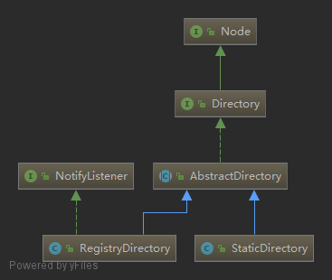

## Dubbo SPI
### Dubbo SPI使用以及规范
* 创建接口并且加上@SPI注解表示该接口是一个Dubbo扩展点，将该扩展点打成一个jar包发布
```java
@SPI
public interface IHelloService {
    String sayHello(String msg);
}
```
* 在需要实现的扩展插件项目中依赖以上接口扩展点，并且实现该接口扩展点
```java
public class HelloServiceImpl implements IHelloService {
    @Override
    public String sayHello(String msg) {
        return "Dubbo SPI Hello:" + msg;
    }
}
```
并且在resources目录先创建META-INF/dubbo/(META-INF/dubbo/;META-INF/dubbo/internal/;META-INF/services/;任选一个)目录，并且在该目录下创建以扩展点接口为名称的文件：xyz.easyjava.dubbo.spi.extend.service.IHelloService
在该文件中填写该扩展点实现的名称以及实现类的全路径，例如：
```java
hello=xyz.easyjava.dubbo.spi.achieve.service.HelloServiceImpl
hello2=xyz.easyjava.dubbo.spi.achieve.service.HelloServiceImpl2
```
* 现在就可以在需要使用该扩展的地方使用了，方式如下：
```java
public class DubboSpiTest {
    public static void main(String[] args) {
        IHelloService extension = ExtensionLoader.getExtensionLoader(IHelloService.class).getExtension("hello2");
        System.out.println(extension.sayHello("MrAToo"));
        IHelloService adaptiveExtension = ExtensionLoader.getExtensionLoader(IHelloService.class).getAdaptiveExtension();
        System.out.println(adaptiveExtension.sayHello("MrAToo2"));
    }
}
```

### 源码分析
先从`ExtensionLoader.getExtensionLoader(IHelloService.class).getAdaptiveExtension();`开始
1. 首先是调用了`ExtensionLoader`类的静态方法`getExtensionLoader(IHelloService.class)`，在该方法中除了校验，主要是实例化了一个`ExtensionLoader`实例，
并且在`ExtensionLoader`的构造方法中通过`objectFactory = (type == ExtensionFactory.class ? null : ExtensionLoader.getExtensionLoader(ExtensionFactory.class).getAdaptiveExtension());`
创建了一个`objectFactory`对象，该对象是一个`ExtensionFactory`
2. 得到`ExtensionLoader`实例对象过后，调用了该对象的`getAdaptiveExtension()`方法，在该方法中调用`createAdaptiveExtension()`创建实例，在`createAdaptiveExtension()`里面调用
`injectExtension((T) getAdaptiveExtensionClass().newInstance());`，该方法是一个注入的方法，先不看`injectExtension()`方法是如何注入的，我们先看实例是如何创建的，很显然，实例作为`injectExtension()`
方法的参数传入，那么`getAdaptiveExtensionClass().newInstance()`这句代码中的`getAdaptiveExtensionClass()`方法返回的Class<T>中T是如何确定的。在`getAdaptiveExtensionClass()`方法中，首先调用了`getExtensionClasses();`
然后判断`cachedAdaptiveClass`是否为null，如果不为null，则直接返回`cachedAdaptiveClass`，那么再看看`getExtensionClasses();`方法中又干了什么，在该方法中又调用了`loadExtensionClasses()`，下面来看看该方法的代码：
```java
private Map<String, Class<?>> loadExtensionClasses() {
    final SPI defaultAnnotation = type.getAnnotation(SPI.class);
    if (defaultAnnotation != null) {
        String value = defaultAnnotation.value();
        if ((value = value.trim()).length() > 0) {
            String[] names = NAME_SEPARATOR.split(value);
            if (names.length > 1) {
                throw new IllegalStateException("more than 1 default extension name on extension " + type.getName()
                        + ": " + Arrays.toString(names));
            }
            if (names.length == 1) {
                cachedDefaultName = names[0];
            }
        }
    }

    Map<String, Class<?>> extensionClasses = new HashMap<String, Class<?>>();
    loadDirectory(extensionClasses, DUBBO_INTERNAL_DIRECTORY, type.getName());
    loadDirectory(extensionClasses, DUBBO_INTERNAL_DIRECTORY, type.getName().replace("org.apache", "com.alibaba"));
    loadDirectory(extensionClasses, DUBBO_DIRECTORY, type.getName());
    loadDirectory(extensionClasses, DUBBO_DIRECTORY, type.getName().replace("org.apache", "com.alibaba"));
    loadDirectory(extensionClasses, SERVICES_DIRECTORY, type.getName());
    loadDirectory(extensionClasses, SERVICES_DIRECTORY, type.getName().replace("org.apache", "com.alibaba"));
    return extensionClasses;
}
```
首先是判断`type`的类对象是否包含@SPI注解，如果包含该注解，则将该注解的value值放到`cachedDefaultName`属性中（该属性在`createAdaptiveExtensionClassCode`方法中使用到，可以通过`getDefaultExtensionName`方法获取默认扩展点，如果自适应扩展点中URL协议为空该值可以作为默认协议），
最后调用`loadDirectory(extensionClasses, DUBBO_DIRECTORY, type.getName());`分别加载`META-INF/dubbo/;META-INF/dubbo/internal/;META-INF/services/;`三个目录下的文件，最终会调用一下方法
```java
/**
 * extensionClasses: 扩展类集合
 * resourceURL: 资源URL
 * clazz: 扩展类Class（实现了扩展接口的类，配置在接口文件中的Class）
 * name: 名称
 */
private void loadClass(Map<String, Class<?>> extensionClasses, java.net.URL resourceURL, Class<?> clazz, String name) throws NoSuchMethodException {
    if (!type.isAssignableFrom(clazz)) {
        throw new IllegalStateException("Error when load extension class(interface: " +
                type + ", class line: " + clazz.getName() + "), class "
                + clazz.getName() + "is not subtype of interface.");
    }
    if (clazz.isAnnotationPresent(Adaptive.class)) {
        if (cachedAdaptiveClass == null) {
            cachedAdaptiveClass = clazz;
        } else if (!cachedAdaptiveClass.equals(clazz)) {
            throw new IllegalStateException("More than 1 adaptive class found: "
                    + cachedAdaptiveClass.getClass().getName()
                    + ", " + clazz.getClass().getName());
        }
    } else if (isWrapperClass(clazz)) {
        Set<Class<?>> wrappers = cachedWrapperClasses;
        if (wrappers == null) {
            cachedWrapperClasses = new ConcurrentHashSet<Class<?>>();
            wrappers = cachedWrapperClasses;
        }
        wrappers.add(clazz);
    } else {
        clazz.getConstructor();
        if (name == null || name.length() == 0) {
            name = findAnnotationName(clazz);
            if (name.length() == 0) {
                throw new IllegalStateException("No such extension name for the class " + clazz.getName() + " in the config " + resourceURL);
            }
        }
        String[] names = NAME_SEPARATOR.split(name);
        if (names != null && names.length > 0) {
            Activate activate = clazz.getAnnotation(Activate.class);
            if (activate != null) {
                cachedActivates.put(names[0], activate);
            } else {
                // support com.alibaba.dubbo.common.extension.Activate
                com.alibaba.dubbo.common.extension.Activate oldActivate = clazz.getAnnotation(com.alibaba.dubbo.common.extension.Activate.class);
                if (oldActivate != null) {
                    cachedActivates.put(names[0], oldActivate);
                }
            }
            for (String n : names) {
                if (!cachedNames.containsKey(clazz)) {
                    cachedNames.put(clazz, n);
                }
                Class<?> c = extensionClasses.get(n);
                if (c == null) {
                    extensionClasses.put(n, clazz);
                } else if (c != clazz) {
                    throw new IllegalStateException("Duplicate extension " + type.getName() + " name " + n + " on " + c.getName() + " and " + clazz.getName());
                }
            }
        }
    }
}
```
1. 先看第一个判断`clazz.isAnnotationPresent(Adaptive.class)`，如果扩展类包含`@Adaptive`注解，则将该扩展作为自定义适配扩展点，赋值给`cachedAdaptiveClass`，前面提到在`getExtensionClasses`方法中，如果`cachedAdaptiveClass`值不为null，则直接返回，
所以，当实现接口的类上有`@Adaptive`注解，则`getAdaptiveExtension();`返回的实例就是当前实例，即自定义适配扩展点。
2. 再看第二个判断`isWrapperClass(clazz)`,判断当前这个扩展是不是一个wrapper，如果是，则将该扩展类放入到`cachedWrapperClasses`中，该变量在`getExtension`方法调用链`createExtension`方法中被使用，大概源码内容为，如果`cachedWrapperClasses`变量有值，则需要包装原始对象。
3. 如果以上两个条件都不成立，则走else逻辑，在该逻辑中，首先判断当前扩展类中是否包含`@Activate`注解，如果包含，则put到`cachedActivates`中。
在判断`cachedNames`中是否包含当前扩展类的类对象，如果不存在，则将class放到`cachedNames`里面，最后循环将name作为key，class作为value放到`extensionClasses`中。

我们在回过头来看，在`getAdaptiveExtensionClass`方法中，如果`cachedAdaptiveClass`为null，则会调用`createAdaptiveExtensionClass`方法，并且将该方法的返回值放入到`cachedAdaptiveClass`中，然后返回。
在`createAdaptiveExtensionClass`方法中，通过调用`createAdaptiveExtensionClassCode`方法返回一串代码，然后动态编译生成Class对象，然后返回。
那么在`createAdaptiveExtensionClassCode`（该方法主要是生成一个代理类）中，这串代码到底是什么，又是如何生成的呢？
首先，dubbo只会为该接口中带有`@Adaptive`注解的方法进行代理，如果该接口中没有带`@Adaptive`注解的方法，则会抛出异常，并且，Dubbo是一个基于URL驱动的RPC框架，方法中标注有`@Adaptive`注解的方法参数上必须
带有`java.net.URL`参数，否则，会抛出异常。
生成的代理类代码如下：
```java
package xyz.easyjava.dubbo.spi.achieve.service;

import org.apache.dubbo.common.extension.ExtensionLoader;
public class Protocol$Adaptive implements org.apache.dubbo.rpc.Protocol {
    public void destroy() {throw new UnsupportedOperationException("method public abstract void org.apache.dubbo.rpc.Protocol.destroy() of interface org.apache.dubbo.rpc.Protocol is not adaptive method!");
    }
    public int getDefaultPort() {throw new UnsupportedOperationException("method public abstract int org.apache.dubbo.rpc.Protocol.getDefaultPort() of interface org.apache.dubbo.rpc.Protocol is not adaptive method!");
    }
    public org.apache.dubbo.rpc.Exporter export(org.apache.dubbo.rpc.Invoker arg0) throws org.apache.dubbo.rpc.RpcException {
        if (arg0 == null) throw new IllegalArgumentException("org.apache.dubbo.rpc.Invoker argument == null");
        if (arg0.getUrl() == null) throw new IllegalArgumentException("org.apache.dubbo.rpc.Invoker argument getUrl() == null");org.apache.dubbo.common.URL url = arg0.getUrl();
        String extName = ( url.getProtocol() == null ? "dubbo" : url.getProtocol() );
        if(extName == null) throw new IllegalStateException("Fail to get extension(org.apache.dubbo.rpc.Protocol) name from url(" + url.toString() + ") use keys([protocol])");
        org.apache.dubbo.rpc.Protocol extension = (org.apache.dubbo.rpc.Protocol)ExtensionLoader.getExtensionLoader(org.apache.dubbo.rpc.Protocol.class).getExtension(extName);
        return extension.export(arg0);
    }
    public org.apache.dubbo.rpc.Invoker refer(java.lang.Class arg0, org.apache.dubbo.common.URL arg1) throws org.apache.dubbo.rpc.RpcException {
        if (arg1 == null) throw new IllegalArgumentException("url == null");
        org.apache.dubbo.common.URL url = arg1;
        String extName = ( url.getProtocol() == null ? "dubbo" : url.getProtocol() );
        if(extName == null) throw new IllegalStateException("Fail to get extension(org.apache.dubbo.rpc.Protocol) name from url(" + url.toString() + ") use keys([protocol])");
        org.apache.dubbo.rpc.Protocol extension = (org.apache.dubbo.rpc.Protocol)ExtensionLoader.getExtensionLoader(org.apache.dubbo.rpc.Protocol.class).getExtension(extName);
        return extension.refer(arg0, arg1);
    }
}
```
从上面生成的类来看，dubbo对扩展接口上带有`@Adaptive`注解的方法进行了代理，没有标注`@Adaptive`的方法，直接抛出`UnsupportedOperationException`异常。被代理的方法通过URL协议来获取一个扩展点。

接下来，分析`injectExtension()`方法，也就是Dubbo中的依赖注入，Duboo支持Spring的依赖注入以及Dubbo自己的SPI自适应扩展点。
在该方法中可以看出，当前自适应扩展点中是否包含一个setter方法，有且只有一个参数的public的方法，并且该方法没有标注`@DisableInject`注解，那么Dubbo会为该自适应扩展点依赖注入。
被注入的对象核心代码在`objectFactory.getExtension(pt, property)`通过`objectFactory`的`getExtension`方法获得被注入的对象，然后放到当前自适应扩展点，实现依赖注入。
那么`objectFactory`对象是什么，在什么时候被实例化的？
还记得在最开始通过`getExtensionLoader(IHelloService.class)`获得一个`ExtensionLoader`对象的时候，由于`ExtensionLoader`类的构造方法是私有化的，所以在`getExtensionLoader`方法中
创建了`ExtensionLoader`对象，然而就在这个私有化的构造方法中，有这样一句代码
```java
objectFactory = (type == ExtensionFactory.class ? null : ExtensionLoader.getExtensionLoader(ExtensionFactory.class).getAdaptiveExtension());
```
这就是`objectFactory`对象实例化的地方。
这里有创建了一个`ExtensionFactory`类的`ExtensionLoader`对象，并且将这个对象缓存在了`EXTENSION_LOADERS`（所以，整个运行过程中`ExtensionFactory`只有一个，并且都是`AdaptiveExtensionFactory`），然后调用了该对象的`getAdaptiveExtension`方法，该方法前面已经分析过来，
返回一个自适应扩展点。然后我们看`ExtensionFactory`的实现类，有一个名为`AdaptiveExtensionFactory`的自适应扩展点（因为该类上面标注了`@Adaptive`注解），所以我们可以发现`objectFactory`
对象的实例其实就是`AdaptiveExtensionFactory`类的实例对象。回到`injectExtension`方法的`objectFactory.getExtension(pt, property)`代码上，这里实际上调用的就是`AdaptiveExtensionFactory`
里面的`getExtension`方法。该方法如下：
```java
public <T> T getExtension(Class<T> type, String name) {
        for (ExtensionFactory factory : factories) {
            T extension = factory.getExtension(type, name);
            if (extension != null) {
                return extension;
            }
        }
        return null;
    }
```
其中`factories`就是所有的`ExtensionFactory`类的扩展，从所有的扩展点中任意返回一个null的实例返回，dubbo默认有`SpringExtensionFactory`、`SPIExtensionFactory`两个，`SpringExtensionFactory`的实现
就是从Spring的IOC容器中拿到对象注入。如果被注入对象类上标注了`@SPI`注解，那么最终还是交给`SPIExtensionFactory`对象去处理，该类里面有是通过`ExtensionLoader`得到一个自适应扩展点。到此，Dubbo的依赖注入完成。
类图：


## 服务发布流程
Dubbo是阿里巴巴依赖Spring开源的RPC框架，至于为什么要依赖Spring我们不去深究，大概是因为Spring优秀的IOC，又或者是AOP，介于Spring的高度抽象，灵活的设计模式，便于去扩展，所以，Dubbo基于Spring的扩展区实现
Dubbo基于Spring扩展的`NameSpaceHandler`，Spring容器在启动的时候会调用`DubboNamespaceHandler`的`init()`方法，该方法主要是解析Spring配置文件中的Dubbo扩展标签，将其转换成`BeanDefinition`，以便Spring容器进行管理。
Dubbo服务的发布流程是从ServiceBean开始的，因为该类实现了接口`InitializingBean`，该接口会在依赖注入完成过后调用`afterPropertiesSet`方法，而`afterPropertiesSet`方法就是Dubbo启动的关键。
首先在`afterPropertiesSet`方法中经过一些校验，在最后几行代码中，判断，是否支持SpringListener，如果不支持这调用`export`方法，如果支持，则会在Spring启动过程中执行`ServiceBean`中`onApplicationEvent`方法，总之都会调用到`export`方法，
在`export`方法中主要是调用`ServiceBean`父类`ServiceConfig`的`export`方法，在该方法中，首先也是一堆的校验，最后调用`doExport`方法，继续往下看，`doExportUrls()`方法中首先是将所有的注册中心配置拼装成一个URL集合，类似如下：
`registry://localhost:2181/org.apache.dubbo.registry.RegistryService?application=easyjava-dubbo-provider&dubbo=2.0.2&pid=205792&registry=zookeeper&release=2.7.0&timestamp=1574749134905`，然后用循环的方式调用`doExportUrlsFor1Protocol`，
该方法主要作用是将服务拼装成一个URL，如下：
```
dubbo://10.98.217.74:20880/xyz.easyjava.dubbo.api.IHelloService?anyhost=true&application=easyjava-dubbo-provider&bean.name=xyz.easyjava.dubbo.api.IHelloService&bind.ip=10.98.217.74&bind.port=20880&dubbo=2.0.2&generic=false&interface=xyz.easyjava.dubbo.api.IHelloService&methods=sayHello&pid=205792&release=2.7.0&side=provider&timestamp=1574749545179
```
最后将调用一下这句代码
```java
Invoker<?> invoker = proxyFactory.getInvoker(ref, (Class) interfaceClass, registryURL.addParameterAndEncoded(Constants.EXPORT_KEY, url.toFullString()));
DelegateProviderMetaDataInvoker wrapperInvoker = new DelegateProviderMetaDataInvoker(invoker, this);
Exporter<?> exporter = protocol.export(wrapperInvoker);
```
`proxyFactory`是一个自适应扩展点，是`ServiceConfig`的成员变量
`private static final ProxyFactory proxyFactory = ExtensionLoader.getExtensionLoader(ProxyFactory.class).getAdaptiveExtension();`
`ProxyFactory`默认扩展点是`JavassistProxyFactory`，并且该扩展点有一个包装器`StubProxyFactoryWrapper`，所以，`proxyFactory`实际上是`StubProxyFactoryWrapper(JavassistProxyFactory())`
调用`StubProxyFactoryWrapper(JavassistProxyFactory())`的`getInvoker`方法，实际上最终会调用到`JavassistProxyFactory`的`getInvoker`方法，传入三个参数，第一个`ref`是当前服务接口的实现类，
例如：`HelloServiceImpl`，第二个参数`(Class) interfaceClass`是当前服务接口的类对象，第三个参数是注册中心加上服务地址拼接成的一个注册中心地址，服务地址作为注册中心的`export`参数，如下：
```
registry://localhost:2181/org.apache.dubbo.registry.RegistryService?application=easyjava-dubbo-provider&dubbo=2.0.2&export=dubbo%3A%2F%2F10.98.217.74%3A20880%2Fxyz.easyjava.dubbo.api.IHelloService%3Fanyhost%3Dtrue%26application%3Deasyjava-dubbo-provider%26bean.name%3Dxyz.easyjava.dubbo.api.IHelloService%26bind.ip%3D10.98.217.74%26bind.port%3D20880%26dubbo%3D2.0.2%26generic%3Dfalse%26interface%3Dxyz.easyjava.dubbo.api.IHelloService%26methods%3DsayHello%26pid%3D205792%26release%3D2.7.0%26side%3Dprovider%26timestamp%3D1574749545179&pid=205792&registry=zookeeper&release=2.7.0&timestamp=1574749134905
```
在该方法中，主要做了两件事情：
1. 创建一个当前实例对象的`Wrapper`（代理对象），这里为什么需要有这样一层包装，我猜想的话应该是Dubbo的调用是通过URL进行的，我们可以方便的通过传入参数来决定调用哪个方法，我们通过`Arthas`来看一下`Wrapper`对象代码：
```java
package org.apache.dubbo.common.bytecode;

import java.lang.reflect.InvocationTargetException;
import java.util.Map;
import org.apache.dubbo.common.bytecode.ClassGenerator;
import org.apache.dubbo.common.bytecode.NoSuchMethodException;
import org.apache.dubbo.common.bytecode.NoSuchPropertyException;
import org.apache.dubbo.common.bytecode.Wrapper;
import xyz.easyjava.dubbo.provider.service.HelloServiceImpl;

public class Wrapper1
extends Wrapper
implements ClassGenerator.DC {
    public static String[] pns;
    public static Map pts;
    public static String[] mns;
    public static String[] dmns;
    public static Class[] mts0;

    @Override
    public String[] getPropertyNames() {
        return pns;
    }

    @Override
    public boolean hasProperty(String string) {
        return pts.containsKey(string);
    }

    public Class getPropertyType(String string) {
        return (Class)pts.get(string);
    }

    @Override
    public String[] getMethodNames() {
        return mns;
    }

    @Override
    public String[] getDeclaredMethodNames() {
        return dmns;
    }

    @Override
    public void setPropertyValue(Object object, String string, Object object2) {
        try {
            HelloServiceImpl helloServiceImpl = (HelloServiceImpl)object;
        }
        catch (Throwable throwable) {
            throw new IllegalArgumentException(throwable);
        }
        throw new NoSuchPropertyException(new StringBuffer().append("Not found property \"").append(string).append("\" field or setter method in class xyz.easyjava.dubbo.provider.service.HelloServiceImpl.").toString());
    }

    @Override
    public Object getPropertyValue(Object object, String string) {
        try {
            HelloServiceImpl helloServiceImpl = (HelloServiceImpl)object;
        }
        catch (Throwable throwable) {
            throw new IllegalArgumentException(throwable);
        }
        throw new NoSuchPropertyException(new StringBuffer().append("Not found property \"").append(string).append("\" field or setter method in class xyz.easyjava.dubbo.provider.service.HelloServiceImpl.").toString());
    }

    public Object invokeMethod(Object object, String string, Class[] arrclass, Object[] arrobject) throws InvocationTargetException {
        HelloServiceImpl helloServiceImpl;
        try {
            helloServiceImpl = (HelloServiceImpl)object;
        }
        catch (Throwable throwable) {
            throw new IllegalArgumentException(throwable);
        }
        try {
            if ("sayHello".equals(string) && arrclass.length == 1) {
                return helloServiceImpl.sayHello((String)arrobject[0]);
            }
        }
        catch (Throwable throwable) {
            throw new InvocationTargetException(throwable);
        }
        throw new NoSuchMethodException(new StringBuffer().append("Not found method \"").append(string).append("\" in class xyz.easyjava.dubbo.provider.service.HelloServiceImpl.").toString());
    }
}
```
2. 创建一个匿名AbstractProxyInvoker，且`doInvoke`方法实际上是调用的`Wrapper`代理对象的`invokeMethod`方法
最后，该方法会返回一个`AbstractProxyInvoker`，其中`doInvoke(T proxy, String methodName,Class<?>[] parameterTypes,Object[] arguments)`中会调用代理Wrapper类中`wrapper.invokeMethod(proxy, methodName, parameterTypes, arguments);`方法,
得到invoker过后，再次用`DelegateProviderMetaDataInvoker`包装一下，通过`protocol.export(wrapperInvoker);`传入`DelegateProviderMetaDataInvoker`实例对象，得到一个`exporter`，那么这里的`protocol`又是什么实现呢，
`Protocol protocol = ExtensionLoader.getExtensionLoader(Protocol.class).getAdaptiveExtension();`这里又是一个自适应扩展点，会生成一个`Protocol$Adaptive`，我们前面已经分析过了，`Protocol$Adaptive`会
通过当前协议动态获取一个扩展点，那么当前URL的协议是`registry`,所以，这里应该会调用到`RegistryProtocol`的`export`方法，在该方法中，会调用`getRegistryUrl()`方法，这个方法将注册中心协议从`registry`改为
URL中`registry`参数值作为协议头，如果不存在则默认使用dubbo注册中心。
拿到注册中心和服务发布URL过后，该方法核心代码是`final ExporterChangeableWrapper<T> exporter = doLocalExport(originInvoker, providerUrl);`，这句代码就是暴露服务的关键，服务暴露过后，该方法中还有一句核心代码
`register(registryUrl, registeredProviderUrl);`，这句代码就是将服务地址注册到注册中心，我们一个一个的来分析，dubbo究竟是如何发布服务并且将服务URL注册到注册中心的。
首先是服务暴露，通过查看`doLocalExport`方法，该方法需要两个参数，当前`invoker`和`providerUrl`服务地址,该方法源码：
```java
private <T> ExporterChangeableWrapper<T> doLocalExport(final Invoker<T> originInvoker, URL providerUrl) {
    String key = getCacheKey(originInvoker);
    ExporterChangeableWrapper<T> exporter = (ExporterChangeableWrapper<T>) bounds.get(key);
    if (exporter == null) {
        synchronized (bounds) {
            exporter = (ExporterChangeableWrapper<T>) bounds.get(key);
            if (exporter == null) {
                final Invoker<?> invokerDelegete = new InvokerDelegate<T>(originInvoker, providerUrl);
                exporter = new ExporterChangeableWrapper<T>((Exporter<T>) protocol.export(invokerDelegete), originInvoker);
                bounds.put(key, exporter);
            }
        }
    }
    return exporter;
}
```
我们可以看到`protocol.export(invokerDelegete)`，这里的`protocol`是什么取决于`invokerDelegete`中URL协议是什么，这里显然URL是服务地址，所以协议应该是dubbo，所以这里的`protocol`最终得到的就是
`DubboProtocol`，查看`DubboProtocol`中的`export`方法，该方法中会调用`openServer(url);`，传入服务暴露地址，在`openServer(url);`方法中首先从缓存中获取一个`server`，如果缓存中没有，则创建一个，
那么我们看`server`是如何创建的，参看`createServer`方法，
```java
ExchangeServer server;
try {
    server = Exchangers.bind(url, requestHandler);
} catch (RemotingException e) {
    throw new RpcException("Fail to start server(url: " + url + ") " + e.getMessage(), e);
}
```
通过`Exchangers.bind(url, requestHandler);`得到一个`server`，该方法最终会调用到`HeaderExchanger`中的`bind`方法，到这里还没完，在`HeaderExchanger`的`bind`方法中创建一个`HeaderExchangeServer`对象，
该对象需要一个`Server`参数，这个`Server`从`Transporters.bind`中得来，这里又是一个自适应扩展点，但最终会调到`NettyTransporter`中的`bind`方法，最终在这里new了一个`NettyServer`，发布服务。
接下来分析服务注册，在`RegistryProtocol`的`export`方法中，有这样一句代码`final Registry registry = getRegistry(originInvoker);`，这句代码的作用就是活的一个注册中心，我们来分析一下`getRegistry`方法，
```java
private Registry getRegistry(final Invoker<?> originInvoker) {
    URL registryUrl = getRegistryUrl(originInvoker);
    return registryFactory.getRegistry(registryUrl);
}
```
从代码中可以看出，首先通过URL得到注册中心的协议地址，这个时候这里应该是`zookeeper://...`，然后通过`registryFactory`得到一个注册中心工厂对象，但是这里的`registryFactory`又是什么，改成员变量有一个setter方法，
可见，这里的`registryFactory`是依赖注入进来的，又是一个`RegistryFactory$Adaptive`，通过协议地址动态活的一个`RegistryFactory`，当前协议为zookeeper，所以这里的`registryFactory`就是`ZookeeperRegistryFactory`
然后调用`ZookeeperRegistryFactory`的`getRegistry`方法，发现该类中并没有这个方法，所以会调用父类`AbstractRegistryFactory`的`getRegistry`方法，这是一个模板方法，具体实现由子类完成，在该方法中`registry = createRegistry(url);`就是
由子类`ZookeeperRegistryFactory`实现的，实现如下：
```java
@Override
public Registry createRegistry(URL url) {
    return new ZookeeperRegistry(url, zookeeperTransporter);
}
```
回到`RegistryProtocol`的`export`方法中，得到一个`ZookeeperRegistry`注册中心过后，调用``方法，该方法实现如下：
```java
public void register(URL registryUrl, URL registeredProviderUrl) {
    Registry registry = registryFactory.getRegistry(registryUrl);
    registry.register(registeredProviderUrl);
}
```
得到一个注册中心，并且注册，这里得到的注册中心和`getRegistry`方法得到注册中心方法一样，得到的都是`ZookeeperRegistry`，然后看`ZookeeperRegistry`的`register`方法，同理，`ZookeeperRegistry`中没有`register`则调用
父类`FailbackRegistry`的`register`方法，并且传入服务暴露URL，改方法又是一个模板方法，最终会调用`doRegister`，而这个方法在子类`ZookeeperRegistry`中实现，该方法如下：
```java
@Override
public void doRegister(URL url) {
    try {
        zkClient.create(toUrlPath(url), url.getParameter(Constants.DYNAMIC_KEY, true));
    } catch (Throwable e) {
        throw new RpcException("Failed to register " + url + " to zookeeper " + getUrl() + ", cause: " + e.getMessage(), e);
    }
}
```
这里直接创建一个zookeeper节点，即服务注册，生成的path路径为：
```
/dubbo/xyz.easyjava.dubbo.api.IHelloService/providers/dubbo%3A%2F%2F10.98.217.74%3A20880%2Fxyz.easyjava.dubbo.api.IHelloService%3Fanyhost%3Dtrue%26application%3Deasyjava-dubbo-provider%26bean.name%3Dxyz.easyjava.dubbo.api.IHelloService%26dubbo%3D2.0.2%26generic%3Dfalse%26interface%3Dxyz.easyjava.dubbo.api.IHelloService%26methods%3DsayHello%26pid%3D212032%26release%3D2.7.0%26side%3Dprovider%26timestamp%3D1574752829404
```
以上就是服务注册已经服务暴露全过程。

## 服务引用初始化过程
Dubbo服务引用的时机有两个，第一个是Spring容器在调用`ReferenceBean`中`afterPropertiesSet`方法时，第二个是`ReferenceBean`对应的服务在被注入到其他对象中时，两者的区别在于第一种是饿汉式的，第二种是懒汉式的，
Dubbo默认是懒汉式的，我们可以通过配置`<dubbo:reference init='true'>`来将其改为饿汉式。
不管服务引用是饿汉还是懒汉模式，Dubbo都会调用`ReferenceBean`的`getObject`方法，接下来我们就从`getObject`方法开始分析，在`get`方法中，如果`ReferenceBean`对应的服务引用对象`ref`已存在，则直接返回，
如果不存在，则先调用`init`方法，服务引用对象`ref`就是在这里面进行创建的。`init`方法中除了对配置解析拼接到map中以外，最重要的是`ref = createProxy(map);`方法，在`createProxy`方法中，
首先是判断是否是本地调用，如果是，则创建`InjvmProtocol`的`refer`方法创建`InjvmInvoker`，则读取直连配置或注册中心URL（这里需要注意的是，如果选择了服务直连的方式，注册中心将失效，该方式用于在开发阶段调试过后一定要记得将其关掉），
如果urls只要一个，则直接通过`refProtocol.refer()`调用，如果urls有多个，则循环调用`refprotocol.refer`并且将invoker放到`invokers`List中，最后调用`cluster.join(new StaticDirectory(invokers))`将多个`invoker`伪装成一个`invoker`,
并且传入一个`StaticDirectory`静态目录服务，因为这里要么是多个注册中心，要么是多个服务提供者，而这些`invoker`是不会动态变化的。这个时候的`cluster`是一个自适应扩展点`Cluster$Adaptive`，循环调用时需要注意，如果有多个注册中心，
则在URL中添加`cluster`参数，值为`registryaware`,同样调用`cluster.join(new StaticDirectory(u,invokers))`，不过这里在创建`StaticDirectory`静态目录服务的时候多传入了一个注册中心的URL。这里先不去深究。
接下来分析`invoker`的创建过程，`invoker`的创建是通过`protocol.refer`方法，`protocol`的实现有很多，常用的是`RegistryProtocol`（注册中心）和`DubboProtocol`（服务直连使用Dubbo协议），这里只分析这两种协议。

### DubboProtocol
```java
class DubboProtocol {
    //...
    @Override
    public <T> Invoker<T> refer(Class<T> serviceType, URL url) throws RpcException {
        optimizeSerialization(url);
        // create rpc invoker.
        DubboInvoker<T> invoker = new DubboInvoker<T>(serviceType, url, getClients(url), invokers);
        invokers.add(invoker);
        return invoker;
    }
    
    private ExchangeClient[] getClients(URL url) {
        // whether to share connection
        boolean service_share_connect = false;
        int connections = url.getParameter(Constants.CONNECTIONS_KEY, 0);
        // if not configured, connection is shared, otherwise, one connection for one service
        if (connections == 0) {
            service_share_connect = true;
            connections = 1;
        }
        ExchangeClient[] clients = new ExchangeClient[connections];
        for (int i = 0; i < clients.length; i++) {
            if (service_share_connect) {
                clients[i] = getSharedClient(url);
            } else {
                clients[i] = initClient(url);
            }
        }
        return clients;
    }
    //...
}
```
DubboProtocol的`refer`方法很简单，直接创建一个`DubboInvoker`返回，但是这里值得注意的是`getClients(url)`方法，该方法中，首先会从url中读取参数`connections`，该参数在
```xml
<dubbo:reference id="helloService" interface="xyz.easyjava.dubbo.api.IHelloService" url="dubbo://10.98.217.74:20880;dubbo://10.98.217.73:20880" connections="0"/>
```
中被指定，如果不指定，则默认为0，该值有三个，分别是：
* 0：表示该服务使用JVM共享长连接（缺省）
* 1：表示该服务使用独立一条长连接
* 2：表示该服务使用独立两条长连接，这种方式一般使用于负载较大的服务。
所以，这里默认使用JVM共享长连接的方法，这个时候代码会执行`getSharedClient(url)`，该方法中首先从缓存中取，如果缓存未命中，则调用`initClient(url)`创建一个新的`ExchangeClient`，最后通过`ReferenceCountExchangeClient`包装过后放入到缓存最后返回，
再来看一下`initClient`方法，`initClient`方法首先判断客户端类型，默认为Netty，并且设置默认心跳间隔时间，最后判断是否延迟链接，如果是延迟连接，则创建`LazyConnectExchangeClient`，否则调用`Exchangers.connect(url, requestHandler)`,
延迟`LazyConnectExchangeClient`在发送请求之前调用`Exchangers.connect(url, requestHandler)`方法，所以，这里我们直接分析，实际上这里最终调用的是`HeaderExchanger.connect(URL url, ExchangeHandler handler)`，
```java
class HeaderExchanger {
    //...
    @Override
    public ExchangeClient connect(URL url, ExchangeHandler handler) throws RemotingException {
        return new HeaderExchangeClient(Transporters.connect(url, new DecodeHandler(new HeaderExchangeHandler(handler))), true);
    }
    //...
}
```
经过深入分析，`Transporters.connect`最终调用的是`NettyTransporter.connect`，方法中直接创建一个`NettyClient`，最终在`NettyClient`中连接目标服务，并且保存着客户端和服务间的`channel`，建立长连接。

### RegistryProtocol
在`RegistryProtocol`的`refer`方法中，首先设置URL协议头，从`registry`改为`Zookeeper`，然后通过注册中心工厂得到一个注册中心对象，这里得到的是`ZookeeperRegistry`，最后通过`group`判断调用`doRefer`方法的`cluster`参数应该是哪一个。
这里并不影响主流程，我们接着看`doRefer`方法，方法代码如下：
```java
class RegistryProtocol {
    //...
    private <T> Invoker<T> doRefer(Cluster cluster, Registry registry, Class<T> type, URL url) {
        RegistryDirectory<T> directory = new RegistryDirectory<T>(type, url);
        directory.setRegistry(registry);
        directory.setProtocol(protocol);
        // all attributes of REFER_KEY
        Map<String, String> parameters = new HashMap<String, String>(directory.getUrl().getParameters());
        URL subscribeUrl = new URL(CONSUMER_PROTOCOL, parameters.remove(REGISTER_IP_KEY), 0, type.getName(), parameters);
        if (!ANY_VALUE.equals(url.getServiceInterface()) && url.getParameter(REGISTER_KEY, true)) {
            registry.register(getRegisteredConsumerUrl(subscribeUrl, url));
        }
        directory.buildRouterChain(subscribeUrl);
        directory.subscribe(subscribeUrl.addParameter(CATEGORY_KEY,
                PROVIDERS_CATEGORY + "," + CONFIGURATORS_CATEGORY + "," + ROUTERS_CATEGORY));
        Invoker invoker = cluster.join(directory);
        ProviderConsumerRegTable.registerConsumer(invoker, url, subscribeUrl, directory);
        return invoker;
    }
    //...
}
```
以上代码首先创建注册中心目录服务，并且设置器注册中心对象`ZookeeperRegistry`和协议`Protocol$Adaptive`，然后组装消费者URL`subscribeUrl`，注册到注册中心，构建路由器链，订阅providers,routers,configurators.
最后执行`Invoker invoker = cluster.join(directory);`并返回`invoker`，首先来分析，服务订阅过程
```java
directory.subscribe(subscribeUrl.addParameter(CATEGORY_KEY,
                PROVIDERS_CATEGORY + "," + CONFIGURATORS_CATEGORY + "," + ROUTERS_CATEGORY));
```
服务订阅过程从`directory.subscribe`开始，在`RegistryDirectory`中调用`registry.subscribe(url, this);`，这里的`registry`是在`doRefer`方法中注入的，实例为`ZookeeperRegistry`，在`ZookeeperRegistry`的`subscribe`方法中
需要两个参数，一个URL和一个Listener，而这里传了this，说明这里this实现了`NotifyListener`接口，所以，这里传入的是this，接下来看`ZookeeperRegistry`的`subscribe`方法，发现该类中并没有此方法，那么必然会调父类的`subscribe`方法，
这里又是一个模板方法，最终还是会调用子类的实现`doSubscribe`方法，该方法中主要注册`Zookeeper`监听，如果有如果有节点变动，则会通知到`ZookeeperRegistry`中`notify`方法，传入`listener`，该方法调用链为：
```
ZookeeperRegistry.notify -> ZookeeperRegistry.doNotify -> AbstractRegistry.notify -> listener.notify(categoryList)(RegistryDirectory.notify)
```
categoryList：该参数为providers,routers,configurators节点下的所有URL地址。该方法中首先将注册中心读取到的URL转换成对象，比如Router,Configurator最后调用`refreshInvoker`，下面看一下`refreshInvoker`方法的实现：
```java
class RegistryDirectory {
    private void refreshInvoker(List<URL> invokerUrls) {
        Assert.notNull(invokerUrls, "invokerUrls should not be null");

        if (invokerUrls.size() == 1 && invokerUrls.get(0) != null && Constants.EMPTY_PROTOCOL.equals(invokerUrls
                .get(0)
                .getProtocol())) {
            this.forbidden = true; // Forbid to access
            this.invokers = Collections.emptyList();
            routerChain.setInvokers(this.invokers);
            destroyAllInvokers(); // Close all invokers
        } else {
            this.forbidden = false; // Allow to access
            Map<String, Invoker<T>> oldUrlInvokerMap = this.urlInvokerMap; // local reference
            if (invokerUrls == Collections.<URL>emptyList()) {
                invokerUrls = new ArrayList<>();
            }
            if (invokerUrls.isEmpty() && this.cachedInvokerUrls != null) {
                invokerUrls.addAll(this.cachedInvokerUrls);
            } else {
                this.cachedInvokerUrls = new HashSet<>();
                this.cachedInvokerUrls.addAll(invokerUrls);//Cached invoker urls, convenient for comparison
            }
            if (invokerUrls.isEmpty()) {
                return;
            }
            Map<String, Invoker<T>> newUrlInvokerMap = toInvokers(invokerUrls);// Translate url list to Invoker map

            // state change
            // If the calculation is wrong, it is not processed.
            if (newUrlInvokerMap == null || newUrlInvokerMap.size() == 0) {
                logger.error(new IllegalStateException("urls to invokers error .invokerUrls.size :" + invokerUrls.size() + ", invoker.size :0. urls :" + invokerUrls
                        .toString()));
                return;
            }

            List<Invoker<T>> newInvokers = Collections.unmodifiableList(new ArrayList<>(newUrlInvokerMap.values()));
            // pre-route and build cache, notice that route cache should build on original Invoker list.
            // toMergeMethodInvokerMap() will wrap some invokers having different groups, those wrapped invokers not should be routed.
            routerChain.setInvokers(newInvokers);
            this.invokers = multiGroup ? toMergeInvokerList(newInvokers) : newInvokers;
            this.urlInvokerMap = newUrlInvokerMap;

            try {
                destroyUnusedInvokers(oldUrlInvokerMap, newUrlInvokerMap); // Close the unused Invoker
            } catch (Exception e) {
                logger.warn("destroyUnusedInvokers error. ", e);
            }
        }
    }
}
```
首先判断协议地址是否只有一个，并且协议为`empty`协议，如果是，销毁所有`invokers`，否则将URL列表转成`Invoker`（这里根据协议会创建`DubboInvoker`）列表得到`newUrlInvokerMap`，最后将赋值给`urlInvokerMap`，达到刷新`urlInvokerMap`的目的，
并且关闭关闭未使用的`Invoker`，回到`RegistryProtocol`的`doRefer`方法的`Invoker invoker = cluster.join(directory);`，这行代码将服务目录传入，其目的是做客户端负载均衡和服务容错，总之提供集群服务治理支持，这块后面单独分析。


### 创建代理
不管是`DubboProtocol`还是`RegistryProtocol`最后都会返回一个`Invoker`，这个`Invoker`就是调用服务的客户端，里面封装了和服务端的长连接。但是如果我们直接将`Invoker`对象拿到业务代码中调用，这样对于我们的业务来说侵入性太高，
所以Dubbo使用代理的方式实现业务的零侵入，回到`ReferenceConfig`的`createProxy`方法，在最后一行代码`return (T) proxyFactory.getProxy(invoker);`返回一个代理对象，这里的`proxyFactory`是一个`JavassistProxyFactory`,
这里首先会调用父类`AbstractProxyFactory`的`getProxy`方法，然后调用`JavassistProxyFactory`的`getProxy`方法，代理类就是在该方法中被生成的，接下来看下生成的代理类：
```java
package org.apache.dubbo.common.bytecode;

import com.alibaba.dubbo.rpc.service.EchoService;
import java.lang.reflect.InvocationHandler;
import java.lang.reflect.Method;
import org.apache.dubbo.common.bytecode.ClassGenerator;
import xyz.easyjava.dubbo.api.IHelloService;

public class proxy0
implements ClassGenerator.DC,
EchoService,
IHelloService {
    public static Method[] methods;
    private InvocationHandler handler;

    public String sayHello(String string) {
        Object[] arrobject = new Object[]{string};
        Object object = this.handler.invoke(this, methods[0], arrobject);
        return (String)object;
    }

    @Override
    public Object $echo(Object object) {
        Object[] arrobject = new Object[]{object};
        Object object2 = this.handler.invoke(this, methods[1], arrobject);
        return object2;
    }

    public proxy0() {
    }

    public proxy0(InvocationHandler invocationHandler) {
        this.handler = invocationHandler;
    }
}
```
该代理类在创建实例的时候传入了一个`InvokerInvocationHandler(invoker)`，所以，服务调用时其实最终会调用到`InvokerInvocationHandler`的`invoke`方法：
```java
public class InvokerInvocationHandler implements InvocationHandler {
    private static final Logger logger = LoggerFactory.getLogger(InvokerInvocationHandler.class);
    private final Invoker<?> invoker;

    public InvokerInvocationHandler(Invoker<?> handler) {
        this.invoker = handler;
    }

    @Override
    public Object invoke(Object proxy, Method method, Object[] args) throws Throwable {
        String methodName = method.getName();
        Class<?>[] parameterTypes = method.getParameterTypes();
        if (method.getDeclaringClass() == Object.class) {
            return method.invoke(invoker, args);
        }
        if ("toString".equals(methodName) && parameterTypes.length == 0) {
            return invoker.toString();
        }
        if ("hashCode".equals(methodName) && parameterTypes.length == 0) {
            return invoker.hashCode();
        }
        if ("equals".equals(methodName) && parameterTypes.length == 1) {
            return invoker.equals(args[0]);
        }

        return invoker.invoke(createInvocation(method, args)).recreate();
    }

    private RpcInvocation createInvocation(Method method, Object[] args) {
        RpcInvocation invocation = new RpcInvocation(method, args);
        if (RpcUtils.hasFutureReturnType(method)) {
            invocation.setAttachment(Constants.FUTURE_RETURNTYPE_KEY, "true");
            invocation.setAttachment(Constants.ASYNC_KEY, "true");
        }
        return invocation;
    }

}
```

## 服务目录
服务目录在前面将`RegistryProtocol`引入的时候已经讲过了，其主要作用是列出所有`invoker`，下面来看一下依赖关系：

由上图可见，`AbstractDirectory`里面实现了list服务列举方法，该方法肯定是一个模板方法，具体实现由子类提供，接下里分析它的两个实现`StaticDirectory`和`RegistryDirectory`，顾名思义，`StaticDirectory`是静态目录服务，
即`invokers`是固定不变的，该目录适用于注册中心，比如有三个注册中心，那么这三个注册中心在运行过程中是不会动态改变的。`RegistryDirectory`是动态的，具体的`invokers`会根据服务注册中心的变动而变动。
`StaticDirectory`实现很简单，这里不做过多分析，重点分析`RegistryDirectory`，`RegistryDirectory`实现了`NotifyListener`接口，改接口只有一个方法`notify`，该方法会在`ZookeeperRegistry`的`doSubscribe`（即服务订阅）时被注册，
在`zookeeper`注册中心的服务节点变动时异步通知调用，得到更新过后的URL过后，会调用`refreshInvoker`方法刷新`Invoker`列表，改方法在服务引入时分析过了，主要就是将URL列表转换成`Invoker`列表，放到一个MAP中来达到更新`invoker`的目的。
总结：服务目录可以看成是一个`List<Invoker>`。

## 服务路由
服务路由的作用是根据用户配置的路由规则来筛选服务提供者。比如有这样一条规则：
```
host = 10.20.153.10 => host = 10.20.153.11
```
该条规则表示 IP 为 10.20.153.10 的服务消费者只可调用 IP 为 10.20.153.11 机器上的服务，不可调用其他机器上的服务

## 服务集群
集群的工作可以分为两个阶段，第一：服务消费者初始化时创建`ClusterInvoker`对象，其目的是将`Directory`包装，伪装成一个`invoker`返回，第二：服务调用时，这个时候主要是调用`AbstractClusterInvoker`的`invoke`方法，该方法又是一个模板方法，
最终会调用具体实现类的`doInvoke`方法，在`doInvoke`方法中，封装了一些集群容错的机制，就拿缺省的`FailoverClusterInvoker`来分析，该方式在调用时出现错误，如果是业务异常，则直接抛出，如果不是业务异常，记录异常，然后重试，
重试次数可以在`retries`属性中指定，默认两次，不算第一次。

## 负载均衡
负载均衡是在服务调用过程中被确定的，具体在`invoker.invoke`方法中被初始化，这里的负载均衡器为`LoadBalance$Adaptive`，具体使用某个负载均衡器取决于用户配置，默认使用随机算法，这里不深入分析负载均衡算法。


## 服务调用过程
服务调用过程分为两个部分
* 消费端发送请求
* 服务端接受请求处理
### 消费端发送请求
在分析服务调用之前，先来看一下服务请求发送流程图

在前面服务引入创建代理时讲到，客户端是通过代理对象调用发送网络请求的，而代理对象是调用`InvokerInvocationHandler`的`invoke`方法，所以，服务调用过程理应从这里开始。
该方法中，首先会封装请求参数`Invocation`对象，然后调用`invoker`的`invoke`方法，这里前面分析得出这里的`invoker`应该是`MockClusterInvoker`，这里不分析Dubbo的`Mock`机制，直接调用`FailoverClusterInvoker`的`invoker`方法，
改方法在父类`AbstractClusterInvoker`中，在该方法中，主要是初始化了负载均衡器`RandomLoadBalance`，然后调用`FailoverClusterInvoker`的`doInvoke`方法，在该方法中，首先通过负载均衡器拿到一个`invoker`，这里的`invoker`是我们在目录服务中`RegistryDirectory`回调
`notify`通知中创建的，这里创建的是`DubboInvoker`，所以这里调用`AbstractInvoker`中的`invoke`方法，然后该方法会调用`DubboInvoker`的`doInvoke`方法，当然，这中间会调用一些`Filter`这里不展开分析。
在`doInvoke`方法中，会拿到`ReferenceCountExchangeClient`，然后调用`request`方法，这里的调用链比较长，如下：
```
ReferenceCountExchangeClient.request -> HeaderExchangeClient.request -> HeaderExchangeChannel.request -> HeaderExchangeClient.send -> HeaderExchangeChannel.send -> NettyChannel.send -> NioSocketChannel.writeAndFlush
```
由上面调用链可以看出，最终会通过Netty的channel调用writeAndFlush发送数据，最后将结果返回。当然这里面的数据编解码序列化在这里不展开。

### 服务端接受请求处理
服务端接受请求的入口在`NettyServerHandler`类中的`channelRead`方法，先来看一下调用链
```
NettyServerHandler.channelRead -> AbstractPeer.received -> MultiMessageHandler.received -> HeartbeatHandler.received -> AllChannelHandler.received(该方法中会创建一个线程去执行) -> ChannelEventRunnable.run
-> DecodeHandler.received -> HeaderExchangeHandler.received -> HeaderExchangeHandler.handleRequest -> DubboProtocol$1.reply(这里的DubboProtocol$1是ExchangeHandlerAdapter的子类，定义在DubboProtocol中的匿名内部类，该方法中通过channel和invocation获取invoker对象)
-> DelegateProviderMetaDataInvoker.invoke -> Wrapper1.invokeMethod -> HelloServiceImpl.sayHello
```
代码分析到这里，整个服务请求接受处理差不多就调用完了。