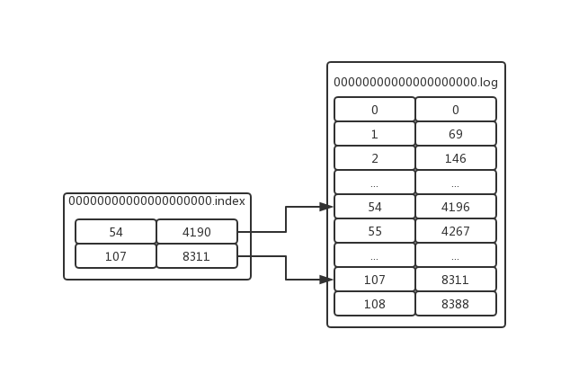

我们都知道Kafka具有很高的吞吐量、数据分片、冗余和容错等优点，一般用于用户行为追踪以及分布式系统日志收集等场景，那么Kafka是如何做到这些优点的呢，今天就让我们来一一分析。

## Kafka入门

### 安装
1. 点击[下载](http://mirror.bit.edu.cn/apache/kafka/2.3.1/kafka_2.11-2.3.1.tgz)
2. 解压:`tar -zxvf kafka_2.11-2.3.1.tgz`
3. 启动zookeeper:`sh ${zookeeperDir}/bin/zkServer.sh start`，zookeeper集群则需要将集群中所有节点启动
4. 配置config目录下的server.properties中:`zookeeper.connect=192.168.3.224:2181`
5. 启动/停止:`sh kafka-server-start.sh -daemon ../config/server.properties`/`sh kafka-server-stop.sh ../config/server.properties`

### 集群配置
配置config目录下server.properties文件
1. 将`broker.id`属性配置为当前节点id，集群中的所有节点id不能相同，例如`broker.id=0/1/2...`
2. 将`advertised.listeners`属性改为当前节点的主机地址，例如`advertised.listeners=PLAINTEXT://192.168.3.224:9092`
这样，当`Broker`启动的时候，会向zookeeper注册自己的主机及端口，其他`Broker`就可以通过ip和端口来连接

## 基本操作
### 命令行操作
* 创建Topic:`sh kafka-topics.sh --create --zookeeper 192.168.3.224:2181 --replication-factor 1 --partitions 1 --topic test`
* 列出所有Topic:`sh kafka-topics.sh --list --zookeeper 192.168.3.224:2181`
* 查看Topic详情:`sh kafka-topics.sh --describe --zookeeper localhost:2181 --topic test`
```shell
[root@MiWiFi-R3L-srv bin]# sh kafka-topics.sh --describe --zookeeper localhost:2181 --topic test
Topic:test	PartitionCount:1	ReplicationFactor:1	Configs:
	Topic: test	Partition: 0	Leader: 0	Replicas: 0	Isr: 0
```
* 发送消息:`sh kafka-console-producer.sh --broker-list 192.168.3.224:9092 --topic test`
* 消费消息:`sh kafka-console-consumer.sh --bootstrap-server localhost:9092 --topic test --from-beginning`

### Java API使用
* producer
```java
public class Producer {
    public static void main(String[] args) {
        Properties properties = new Properties();
        properties.put(ProducerConfig.BOOTSTRAP_SERVERS_CONFIG,"192.168.3.207:9092,192.168.3.9:9092,192.168.3.155:9092");
        properties.put(ProducerConfig.ACKS_CONFIG,"all");
        properties.put(ProducerConfig.KEY_SERIALIZER_CLASS_CONFIG,"org.apache.kafka.common.serialization.IntegerSerializer");
        properties.put(ProducerConfig.VALUE_SERIALIZER_CLASS_CONFIG,"org.apache.kafka.common.serialization.StringSerializer");
        KafkaProducer producer = new KafkaProducer<Integer,String>(properties);
        for (int i=0;i<100;i++) {
            ProducerRecord<Integer,String> record = new ProducerRecord<Integer, String>("firstTopic","HelloWorld" + i);
            Future future = producer.send(record);
            System.out.println(future);
        }
        producer.close();
    }
}
```
* consumer
```java
public class Consumer {
    public static void main(String[] args) throws IOException {
        Properties properties = new Properties();
        properties.put(ConsumerConfig.BOOTSTRAP_SERVERS_CONFIG,"192.168.3.207:9092,192.168.3.9:9092,192.168.3.155:9092");
        properties.put(ConsumerConfig.GROUP_ID_CONFIG,"MrATooConsumer");
        properties.put(ConsumerConfig.ENABLE_AUTO_COMMIT_CONFIG,"true");
        properties.put(ConsumerConfig.KEY_DESERIALIZER_CLASS_CONFIG,"org.apache.kafka.common.serialization.IntegerDeserializer");
        properties.put(ConsumerConfig.VALUE_DESERIALIZER_CLASS_CONFIG,"org.apache.kafka.common.serialization.StringDeserializer");
        KafkaConsumer<Integer,String> consumer = new KafkaConsumer<Integer, String>(properties);
        /*TopicPartition partition = new TopicPartition("firstTopic",1);
        consumer.assign(Arrays.asList(partition));*/

        consumer.subscribe(Arrays.asList("firstTopic"));
        ConsumerRecords<Integer, String> records = consumer.poll(Duration.ofDays(7));
        Iterator<ConsumerRecord<Integer, String>> iterator = records.iterator();
        while (iterator.hasNext()) {
            ConsumerRecord<Integer, String> record = iterator.next();
            System.out.println(record.value());
        }
        consumer.close();
    }
}
```

## 配置分析
### Producer可选配置
* acks:该配置表示`producer`发送到`Broker`上的确认值，该值有三个选项，分别是：
    * 0:`producer`发送消息过后不需要等待`Broker`确认，该方式延时小但消息容易丢失
    * 1:`producer`发送消息过后只需要等待kafka集群的`leader`节点确认，该方式延时和可靠性适中
    * all(-1):`producer`发送消息过后需要等待ISR列表中的所有节点确认，该方式延时较长，但消息不容易丢失。但ISR可以缩小到1，所以并不能百分之百保证消息不丢失。
* batch.size:当生产者发送多个消息到`Broker`上时，为了节约网络开销，可以通过批量的方式来提交消息，可以通过该配置来设置批量提交消息的大小，默认是16kb。也就是，当一批消息达到了
batch.size大小的时候统一发送。
> 注意：这里的batch.size大小是针对同一个`partition`
* linger.ms:消息发送请求的延迟（间隔），即：当消息发送间隔时间较短，并且还没有达到batch.size大小时，这个时候客户端并不会立即发送请求到`Broker`上，而是延迟`linger.ms`过后，将多个消息
合并成一个消息发送，该配置为0，则代表没有延迟，如果配置成正整数值，则会减少请求数量，但也会有消息发送延迟。如果同时配置了`linger.ms`和`batch.size`，则满足一个条件就会发送。
* max.request.size:现在请求数据的最大字节数，默认为1M

### Consumer可选配置
* group.id:kafka中的每个消费者都有一个组，组和消费者是一对多的关系，对于一个Topic而言，如果Topic对应多个组，则类似于ActiveMQ中Topic的概念，如果Topic对应一个组，则类似于ActiveMQ
中Queue的概念，同一个组下的多个消费者可以同时消费一个Topic下的多个分区，一个分区只能分配给一个消费者进行消费。
* enable.auto.commit:消息消费后自动提交，只有当消息被提交过后才会确保消息不会再次被消费，可以接口`auto.commit.interval.ms`来优化自动提交的频率。当然，我们也可以通过
`consumer.commitSync()`方法来手动提交消息。
* auto.offset.reset:
* max.poll.records:配置每次poll消息的数量

## Topic和Partition
### Topic
Topic是一个逻辑的概念，可以认为是一个消息集合，不同的Topic是分开存储的，一个Topic可以有多个生产者向它发送消息，也可由有多个消费者消费消息。

### Partition
一个Topic可以个多个Partition（至少有一个分区），同一个Topic下的不同分区的消息是不同的，每个消息在分配到分区时，都会被分配一个offset（偏移量），kafka通过offset保证消息在同一个
分区的顺序，也就是说，同一个分区的消息是有序的。

### Partition存储
Partition以文件的形式存在于文件系统中，例如：`sh kafka-topics.sh --create --zookeeper 192.168.3.224:2181 --replication-factor 1 --partitions 3 --topic test`，以上命令会创建一个
有三个分区的名称为test的Topic，那么这三个分区会生成三个文件夹均匀分布在不同Broker中，文件夹的命名规则为`<topic_name>-<partition_id>`，partition_id范围为0~3。

## 消息分发策略
一个消息由key和value组成，发送一条消息之前，我们可以指定消息的key和value，然后kafka会根据指定的key和partition机制来决定当前这条消息应该被存储到那个分区中，默认情况下，kafka采用的消息分发机制
是Hash取模算法，如果key为空，则会随机分配一个分区，这个随机分区会在`metadata.max.age.ms`配置指定的时间内固定选择一个，这个值默认是10分钟，也就是说，每10分钟，随机分区会更新一次。

## 消息消费原理
每个Topic有多个Partition，每个Consumer Group有多个消费者，同一个Partition只允许被一个Consumer Group中的一个消费者消费。那么同一个消费者中的消费者是如何去消费同一个Topic下的
多个Partition的呢？这就牵扯到了分区分配策略

### 分区分配策略
kafka中提供两种分区分配策略，分别是Range（范围分区）、RoundRobin（轮询），通过`partition.assignment.strategy`配置来指定分区分配策略。

#### Range（范围分区）
首先将同一个Topic下的所有Partition通过分区ID进行排序，然后将同一个Consumer Group下的所有Consumer按照一定规则排序，然后用Partition总数除以消费者总数，如果除不尽，则将余数
按照顺序分配到排序过后的Consumer上。
例如：现在有一个Topic test，10个分区;一个Consumer Group,三个消费者;
* 将Partition通过ID排序过后得到`test-0,test-1,test-2,test-3,test-4,test-5,test-6,test-7,test-8,test-9`
* 将消费者排序，假如是`C0,C1,C2`
* 先计算`10/3=3`，然后计算`10%3=1`，最后得到三个组，分别是`0,1,2,3`/`4,5,6`/`7,8,9`
* 最后得到的结果是：
    * C0消费`test-0,test-1,test-2,test-3`
    * C1消费`test-4,test-5,test-6`
    * C2消费`test-7,test-8,test-9`
通过上面的例子，可以看出，消费者C0多消费了一个分区，这时设想一下，如果该消费组中同时订阅了n个Topic，采用范围分区算法，那么消费者C0将比该组中的其他消费者多消费了n个分区。

#### RoundRobin（轮询）
把所有的Partition和Consumer按照HashCode排序，然后通过轮询算法将各个Partition分配给Consumer。
例如：现在有一个Topic test，10个分区;一个Consumer Group,三个消费者；
* 将Partition通过HashCode排序，假如得到`test-5,test-8,test-2,test-4,test-3,test-6,test-7,test-9,test-0,test-1`
* 将消费者通过HashCode排序，假如是`C2,C0,C1`
* 最后得到的结果是：
    * C2消费`test-5,test-4,test-7,test-1`
    * C0消费`test-8,test-3,test-9`
    * C1消费`test-2,test-6,test-0`
虽然这里C2消费者比其他消费者多一个，但是如果该消费组订阅了多个Topic，那么将会从C0开始分配，也就是说，消费组中的所有消费者消费的分区差距不会超过1。
注意：使用轮询分区分配策略需要满足一下两个条件
    * 每个主题的消费者实例具有相同数量的流
    * 每个消费者订阅的主题必须是相同的

### 什么时候会触发分区分配策略？
以下几种情况会触发分区分配策略（也可称之为Rebalance），分别是：
* 当有新的消费者加入当前Consumer Group
* 有消费者离开当前消费组，例如宕机或者主动关闭
* Topic新增了分区

### 谁来执行分区分配？
kafka提供一种角色`Coordinator`来执行对消费组Consumer Group的管理，当消费者启动的时候，会向`Broker`确定谁是它们组的Coordinator，之后该组中的所有Consumer都会向Coordinator进行协调通信。

### 如何确定Coordinator角色？
消费者向kafka集群中任意一个Broker发送一个`GroupCoordinatorRequest`请求，Broker会返回一个负载最小的BrokerID，并且将其设置成为Coordinator。

### Rebalance（重新负载）
在执行Rebalance之前，需要保证Coordinator是已经确定好了的，整个Rebalance分为两个步骤
    1. joinGroup:所有Consumer都会想Coordinator发送`JoinGroupRequest`请求，请求中带有`group_id`/`member_id`/`protocol_matedata`等信息，Coordinator会从中选择一个Consumer作为Leader，
    并且把leader_id、组成员信息members、序列化后的订阅信息protocol_metadata以及generation_id(类似于zookeeper epoch)发送给消费者。
    2. syncJoin:Leader Consumer在确定好分区分配方案过后，所有消费者向Coordinator发送一个`SyncGroupRequest`请求，当然这里只有Leader Consumer会真正发送分区分配方案，其他的Consumer
    只是打酱油的，Coordinator在收到Leader Consumer的分区分配方案过后，将其封装成一个`SyncGroupResponse`响应返回给所有的Consumer，所有的Consumer在收到分区分配方案过后，自行消费
    方案中指定的分区。
    
## Offset
前面讲到每个Topic有多个Partition，每个Partition中的消息都不一样，并且每个Partition中的消息都会存在一个offset值，在同一个Partition中的offset是有序的，即kafka可以保证同一个Partition
中的消息是有序的，但是这一特性并不跨分区，也即kafka不能保证跨分区的消息的有序性。

### Offset在哪里维护？
kafka提供一个名为`__consumer_offsets_*`的Topic，该Topic就是来保存每个Consumer Group的消费的每个Partition某一时刻的offset信息，该Topic默认有50个分区，那么，kafka是如何将某个Consumer Group
保存到具体的那个分区的呢？其实，kafka是通过这样一个算法来决定该Consumer Group应该保存在那个分区的，公式：`Math.abs("group_id".hashCode())%groupMetadataTopicPartitionCount`。
确定了分区过后，我们可以通过如下命令查看当前Consumer Group的offset信息
```shell
sh kafka-simple-consumer-shell.sh --topic __consumer_offsets --partition 35 --broker-list 192.168.3.224:9092 --formatter "kafka.coordinator.group.GroupMetadataManager\$OffsetsMessageFormatter"
```

## 多个分区在集群中的分配
一个Topic有多个Partition，那么这么多的Partition是如何在Broker中分布的呢？
* 将i个Partition和n个Broker排序
* 将第1个Partition分配到i%n个Broker上

## 消息的存储
我们都知道在kafka中消息都是以日志文件存储在文件系统中的，由于kafka中一般都存储着海量的数据，所有，kafka中的消息日志分区并不是直接对应一个日志文件，而是对应着一个分区目录，
命名为`<topic_name>_<partition_id>`，例如一个名为test的Topic，有三个分区，那么在集群Broker的`/tmp/kafka-log`(该目录是一个临时目录，一般线上环境都会更改此目录)中就有三个目录，分别是`test-0`/`test-1`/`test-2`

### 消息的文件存储机制
我们知道了Partition的存储是指向一个目录的，其实目录并不具备数据存储的能力，那么kafka中的消息是如何存在于Partition中的呢。kafka为了以后消息的清理以及压缩的便利性和处于性能方面的考虑，
引入一个`LogSegment`的逻辑概念，但实际上消息是以文件的形式存在于Partition目录中的。在一个Partition中可以存在多个`LogSegment`，一个`LogSegment`由一下三个文件组成：
    1. 00000000000000000000.index:offset索引文件，对应offset和物理位置position
    2. 00000000000000000000.timeindex:时间索引文件，映射时间戳和offset的对应关系
    3. 00000000000000000000.log:日志文件，存储Topic消息，包含内容有offset、position、timestamp、消息内容等等
每个`LogSegment`分段的大小可以通过server.properties中的`log.segment.bytes`属性设置，默认是1GB。
`LogSegment`命名的规则是由一个最大支持64位long大小的20位数字字符串组成，每个Partition中的第一个`LogSegment`从0开始，后面的`LogSegment`命名为上一个`LogSegment`消息中最后一个offset+1，
我们可以通过`sh kafka-run-class.sh kafka.tools.DumpLogSegments --files /tmp/kafka-logs/test-0/00000000000000000000.log --print-data-log`命令查看分区0的第一个`LogSegment`。

### LogSegment中index文件和log文件的关联关系
我们知道每个LogSegment都是由index,timeindex,log三个后缀结尾的文件组成。可以通过以下命令查看索引文件内容：
```shell
sh kafka-run-class.sh kafka.tools.DumpLogSegments --files /tmp/kafka-logs/test-0/00000000000000000000.index --print-data-log
```
index和log文件的对应关系如下图：


### 通过offset查找Message的原理分析
通过上一节我们了解到，offset其实是保存的log文件中的简略信息，是log文件中offset和position的跳跃版，也叫稀疏索引，那么消息是如何通过offset查找的呢
例如：我们需要查找test Topic中offset为88的message，那么kafka会经过一下步骤查找消息
1. 分过二分查找法确定该消息存在于那个LogSegment中，那么显然这里offset为88的message肯定存在于00000000000000000000的LogSegment中
2. 同样通过二分查找法找索引文件中小于等于目标消息（offset为88）offset的记录，以上图为例，很显然是{offset:54,position:4190}，从该条记录中可以知道offset为54的消息的position
为4190
3. 打开log文件，从position为4190的地方顺序查找知道找到offset为88的message，然后返回。

## 消息的写入性能
为什么kafka会有这么高的吞吐量，其原因在于kafka在很多地方做了优化，那么在网络传输和磁盘IO上，有很大的优化空间
* 顺序写入：kafka采用顺序写入的方式将消息持久化到磁盘，避免了常规随机写入数据寻址等一系列操作带来的性能损耗。
* 零拷贝：一般情况下，我们将文件数据发送到网络上时，需要将文件冲磁盘读取到操作系统内核空间中，然后拷贝到用户空间，最后将数据发送到网卡，通过网络传输，在kafka中，采用零拷贝的方式，直接
将数据从内核空间发送到网卡通过网络传输，节省了用户空间这一步骤，在性能上有一定的提升。
    * 在linux系统中使用sendFile实现零拷贝
    * 在Java中使用FileChannel.transfer实现零拷贝
    
## 日志清理策略
kafka日志使用分段存储，一方面方便日志的清理，另一方面能确保单个文件的大小从来提升一定的性能。kafka会起一个后台线程来执行日志的清理工作，kafka的日志清理策略有两种
* 根据保留时间：当消息在kafka中存在超过指定的时间，就会触发日志清理，默认时间为7天，可以通过在server.properties中的`log.retention.hours`属性指定
* 根据日志大小：当kafka中消息的大小超过指定大小，就会触发日志清理， 可以通过在server.properties中的`log.retention.bytes`属性指定
以上两种策略只要满足一种则会触发清理。

## 日志压缩策略
我们可以开启kafka的日志压缩功能，开启后，kafka会起一个`Cleaner`线程，定时的去压缩日志，kafka压缩日志的原理是，只保留各个key对应最新的value，而所有修改之前的value则被删除。
类似于数据库中某条数据的更新历史，比如用户1的用户名由张三改为李四再改为王五，那么只保留王五。

## kafka高可用副本机制
kafka中每个Topic可以有多个Partition，并且各个Partition会均匀分布在各个Broker中，但是对于Partition来说，Partition本身存在单点问题，也就是说，当一个Topic中的某个Partition不可用
则代表该Partition中的消息无法被消费，考虑到这一问题，kafka提供了高可用的Partition解决方案，那就是Partition的副本机制。

每个Partition可以有多个副本，并且存在一个leader副本，所有的读写请求都是由leader副本执行，副本集中的其他Partition作为follower副本存在，follower副本的职责只是从leader副本中同步数据
所以，我们可以理解为，在Partition的副本集中存在一主多从的架构模型。

一般情况下，一个分区的多个副本会均匀分布在各个Broker上，当其中一个Broker宕机或者其中一个Partition不可用时，可以重新选举一个新的leader副本继续对外提供服务，这样就可以保持kafka集群的可用性。

### 副本分配算法
1. 将N个Broker和i个Partition排序
2. 将i个Partition分配到(i mod n)个Broker上（这是多个分区在Broker的分配算法，可以参考 多个分区在集群中的分配）
3. 将i个Partition的j个副本分配到((i + j) mod n)个Broker上

我们可以在zookeeper中查看各个Topic的各个分区的状态信息，通过`get /brokers/topics/test/partitions/0/state`命令可以得到以下信息：
```shell
{"controller_epoch":1,"leader":0,"version":1,"leader_epoch":0,"isr":[0]}
```
我这里使用的是单机环境，所以只配置有一个副本（也就是没有副本），这里的ISR只有一个节点，从以上信息可以看出，test Topic中的leader节点也是0。

### 副本机制名词解释
* Leader副本：负责处理客户端的读写操作
* Follower副本：被动的从Leader副本中同步数据
* ISR副本集：包含Leader副本和所有和Leader副本保持数据同步的Follower副本
* LEO：日志末端位移
* HW：水位值，当HW的值等于LEO的时候，表示Follower副本中的数据和Leader副本中的数据已经完全同步，HW永远不会大于LEO的值。当消费者拉取消息的时候，只能拉取该值以前的消息，HW值以后的消息
对于消费者来说是不可见的，也就是说HW的值取决于ISR副本集中最小的LEO值。每个replica都有HW，各个副本都维护着自己的HW。一条消息只有被所有的Follower副本从Leader同步过后才会被认为已提交。
这样有利于避免一条消息还没有来得及同步就宕机，导致消息丢失的情况。当然，我们可以在发送端指定消息的acks模式，该模式在之前讲过。

### 副本协同机制
所有客户端的读写请求都会由Leader副本处理，Follower只负责从Leader副本中同步数据，当Leader副本所在的Broker出现宕机和不可用时，会从Follower副本中重新选举一个成为Leader。
写请求首先由Leader副本处理，之后Follower副本同步，这个步骤会有一定的延迟，当这个延迟在预定的阈值范围内则可以容忍，当这个延迟超出了阈值（可能存在的原因有很多，例如：网络，宕机），Leader
副本就会将这个Follower副本从ISR中踢出去。


### ISR
经过前面的协同机制过后，ISR副本集里面存在的Leader副本和Follower就是 Leader副本和当前可用并且消息量与Leader副本差不多的Follower副本，是整个副本集的一个子集（因为整个副本集可能存在宕机的副本，被踢出了），
具体来说，ISR中的副本必须满足一下条件：
* 副本所在的Broker必须与Zookeeper保持连接
* 副本最后一条消息的offset和Leader副本中最后一条消息的offset差距不能大于执行阈值，该阈值可以通过`replica.lag.time.max.ms`指定
> replica.lag.time.max.ms:如果该Follower在此时间间隔内没有追上Leader副本中的所有消息，则将该副本从ISR副本集中剔除

### 数据同步过程
Producer在发送消息到某个Partition时，先通过Zookeeper找到该Partition的Leader副本，Leader首先会将消息写入到Log日志文件中，然后Follower会从Leader中pull消息，Follower保存消息的顺序
和Leader的顺序一致。Follower在pull消息并且写入Log文件过后，向Leader发送ACK，一旦Leader收到所有Follower的ACk过后，该消息就被认为已经Commit了，最后Leader就会增加HW值并且向Producer发送ACK。

### 副本数据同步机制
初始状态下，Leader和Follower副本的LEO和HW的值都为0，并且Leader中还保存着remoteLEO(表示所有Follower的LEO，初始值也是0)，Follower会不断的向Leader副本发送fetch请求，假如当前没有任何Producer
向Leader副本发送消息，则这个请求会被Leader寄存，当超过了指定阈值（通过`replica.fetch.wait.max.ms`设置）还没有Producer发送消息，则该请求会被强制完成。如果在该阈值指定时间内有新的消息，那么 
该fetch请求会被唤醒，继续执行。这里可以分为两种情况：
* Follower的fetch请求是在Leader处理了Producer消息过后发送的
    * Producer发送一条消息，Leader在收到消息过后做以下事情：
        1. 将消息保存到Log文件中，同时更新自己的LEO值
        2. 更新自己的HW值，但是由于当前还没有Follower发送fetch请求，那么Leader副本那种的RemoteLEO值任然是0，Leader将自己的LEO和RemoteLEO值进行比较，发现最小值是0，所以HW的值还是0。
    * Follower第一次fetch消息
    Leader的处理逻辑是：
        1. 读取Log消息，更新RemoteLEO值（RemoteLEO值由fetch请求中的offset来决定，由于是Follower第一次发送fetch请求，所有请求的offset值为0）。
        2. 更新HW值，但是这时自己的LEO和RemoteLEO任然是0，所有HW的值任然为0。
        3. 将消息内容和当前分区的HW值封装成Response返回给Follower
    Follower的处理逻辑是：
        1. 将消息保存到Log文件中，同时更新LEO值
        2. 更新自己的HW值，将本地的LEO和Leader返回的HW进行比较，取最小值作为自己的HW值，此时最小值为0，所以这时的HW值为0
    * Follower第二次fetch消息
    Leader的处理逻辑是：
        1. 读取Log消息，更新RemoteLEO值（这时fetch请求的offset为1）。
        2. 更新HW值，这时Leader的LEO和RemoteLEO都是1，所有HW的值为1。
        3. 将消息内容和当前分区的HW值封装成Response返回给Follower，这个时候么有消息内容，所以只返回HW值。
    Follower的处理逻辑是：
        1. 如果有消息则保存消息到Log文件中，如果没有则不执行该操作，同时更新LEO值
        2. 更新自己的HW值，将本地的LEO和Leader返回的HW进行比较，取最小值作为自己的HW值，此时两个值都为1，所以这时的HW值为1
到目前为止，数据同步完成。
* Leader还没有处理Producer消息时Follower发送了fetch请求：
当Follower发送fetch请求是，Leader中没有Producer发送消息时，这个fetch请求会被阻塞，当在指定阈值超时时间范围内有新的消息发送过来，Leader处理完成过后，该fetch请求就会被唤醒，继续执行
执行的逻辑和上面一样。

### kafka中是如何处理所有的Replica不工作的情况
在一个分区的ISR中至少有一个副本可用时，kafka就可以保证已经Commit的消息不被丢失，但是当ISR中所有的副本都不可用时，就无法保证了，这时会有两种处理办法
* 等待ISR中任意一个Replica活过来，并且将其设置为Leader
* 等待任意一个Replica活过来，不过是不是存在于ISR副本集中，并且将其设置为Leader
此时就需要在可用性和一致性上做出选择
如果选择第一种方式，那么可能等待的时间较长，就意味着不可用的时间会变长；如果选择第二种方式，虽然等待的时间或许没有第一种那么长，但是因为不存在与ISR中的副本数据同步的延迟较大，所以数据
的一致性就会体现出来。

### ISR设计所解决的问题
在分布式系统中，冗余备份是很常见的一种高可用手段，但是也会带来一些性能上的损耗，例如：
在kafka中，副本中Leader和Follower副本如果采用同步的方式复制消息，那么所有Follower副本的消息都完成复制才算完成了数据的同步，那么如果个别Follower网络延迟较长或者性能本身不太好导致整个集群出现性能瓶颈甚至阻塞；
如果采用异步的方式复制消息，Leader收到消息过后则返回成功，则认为该消息已被提交，Follower异步的从Leader复制消息，如果此时Follower副本复制消息比较慢，此时Leader突然宕机，重新选举Leader
过后，Follower副本和Leader副本的消息存在差距，那么这个差距的消息就会被丢失。
所以Kafka权衡了两种方式的有点，采用ISR副本集来确保各个Follower副本和Leader副本的延迟在阈值范围内，如果超出阈值范围，则将该Follower剔除，这个时候就可以采用同步的方式来复制消息，当Leader
处理的Producer发送的消息过后，kafka只需要等待ISR副本集中的所有Follower同步完成即可认为消息被提交。