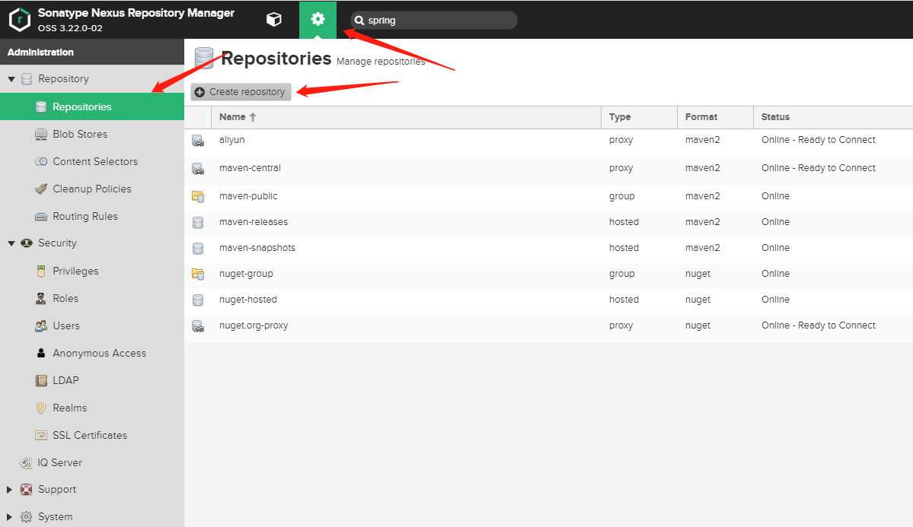
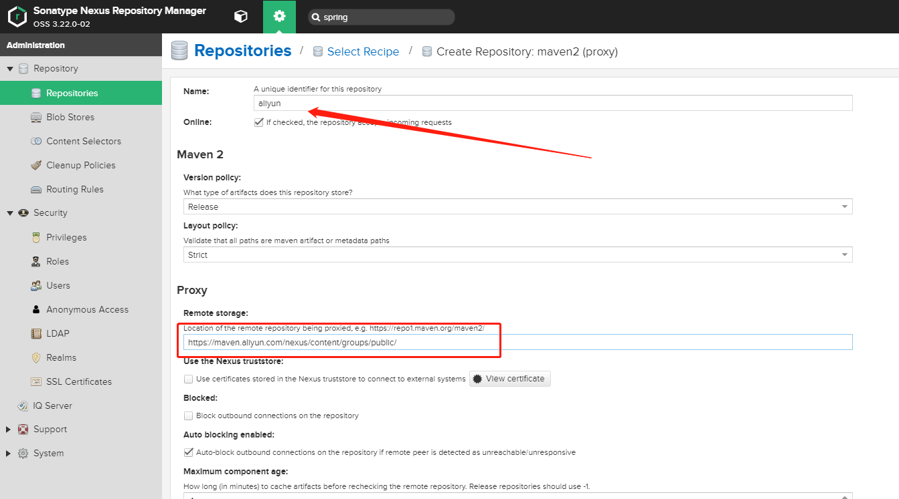
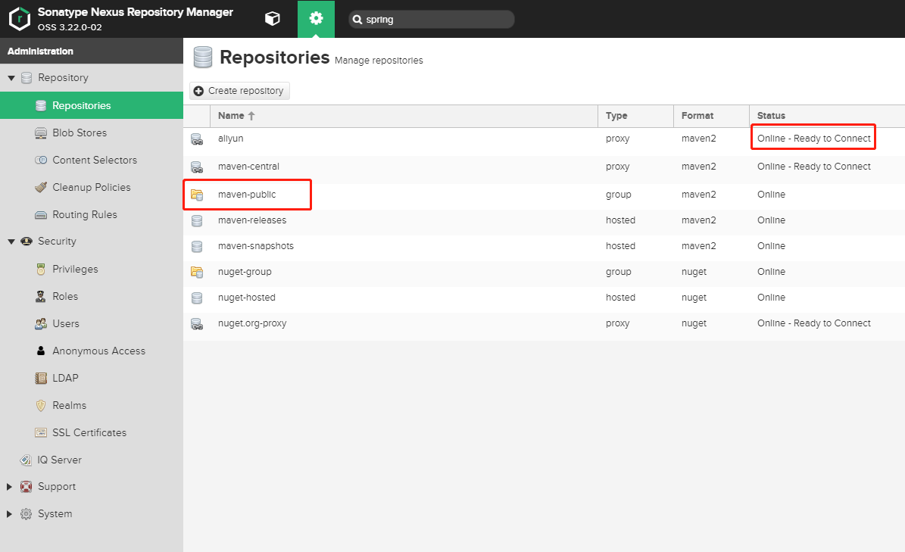
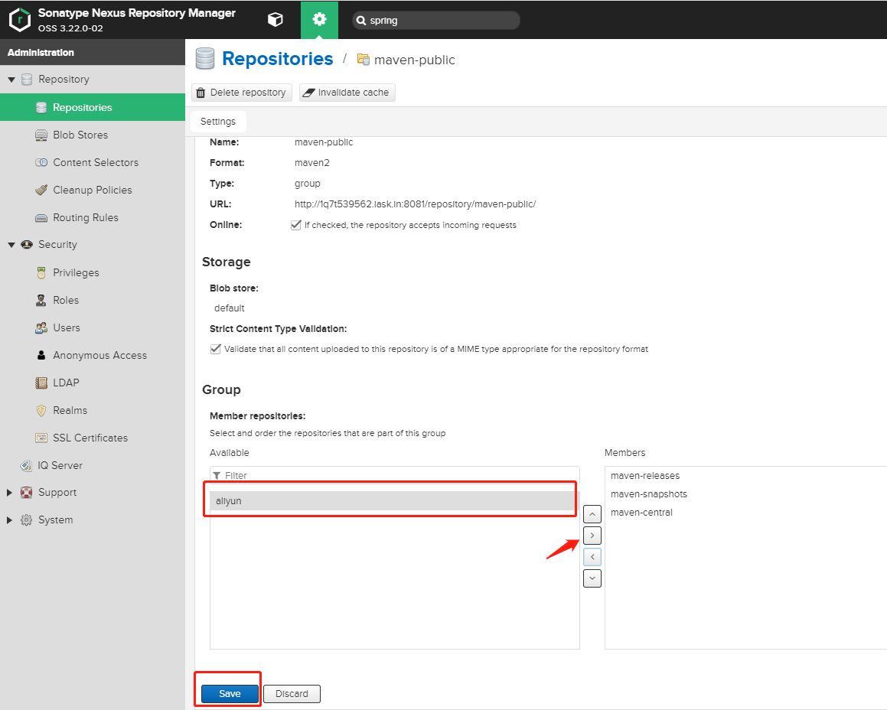

Maven大家都不陌生，做java的同学每天都在和maven打交道，不知道大家在日常生活中是否遇到过这种问题，我当前正在开发的项目想引用之前项目的某个模块，这个时候可能有的同学
就会将之前的模块打成jar包引入进来，但是这样很麻烦，所以今天给大家介绍如何自己搭建自己的maven私服。

## Nexus安装
要想搭建Nexus私服，肯定需要有自己的服务器，并且在服务器安装Nexus，Nexus是什么，这里不做过多的解释，有不知道的同学自行百度，这里我们使用docker-compose进行安装。
很简单，就简单的三步就可以将Nexus服务器搭建完成。
1. 从GitHub上clone [Nexus项目](https://github.com/sonatype/docker-nexus3)
```
[root@node nexus-data]# git clone https://github.com/sonatype/docker-nexus3.git
```
2. 创建一个卷，映射到docker容器里面的/nexus-data目录，并且给该目录赋予权限
```
[root@node nexus-data]# mkdir /nexus-data
[root@node nexus-data]# chmod 777 /nexus-data
```
3. 使用docker-compose构建Nexus服务，需要注意的是，这里的docker-compose.yml文件中的卷映射的是docker命名卷，我们将上一步创建的文件夹映射到容器的/nexus-data目录下即可
```
[root@node nexus-data]# docker-compose up -d
```

## 访问
浏览器访问[http://localhost:8081](http://localhost:8081)，当前由于并没有登录，属于匿名访问，所以所看到的菜单很简单，我们使用右上角的Sign in登录，用户名为`admin`，
密码可在`/nexus-data/admin.password`文件中查看，默认是一个uuid，第一次登录会提示你修改密码。

## 配置Aliyun代理仓库
日常开发中，我们在没有私服的情况下会使用aliyun的maven镜像，那么我们如果使用私服要怎么设置代理仓库呢，步骤如下：
1. 首先创建一个仓库


2. 选择Maven2(proxy)


3. 填写Name和Remote Storage，然后点击Create repository


4. 这里显示就说明创建成功了，然后将代理仓库添加到仓库组，点击`maven-public`


5. 将刚刚添加的代理仓库添加到仓库组中，并且将其排列到最前边，点击Save即可


## 将本地项目部署到maven私服
1. 在本地Maven的setting.xml文件中`servers`节点下添加如下信息：
```
<server>
   <id>releases</id>
   <username>admin</username>
   <password>admin123</password>
</server>
<server>
   <id>snapshots</id>
   <username>admin</username>
   <password>admin123</password>
</server>
```
2. 在项目的`pom.xml`中添加如下配置，需要注意的是这里的id需要和setting.xml中server节点上配置的id一致
```
<distributionManagement>
  <repository>
    <id>releases</id>
    <url>http://ip:port/repository/maven-releases/</url>
  </repository>
 
  <snapshotRepository>
    <id>snapshots</id>
    <url>http://ip:port/repository/maven-snapshots/</url>
  </snapshotRepository>
</distributionManagement>
```
3. 通过`mvn deploy`命令即可部署当前项目到Nexus