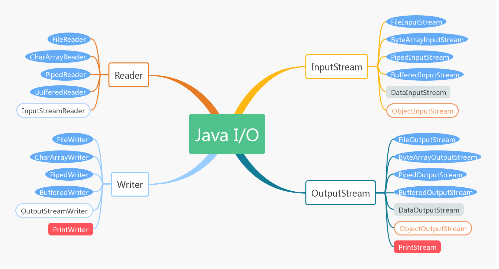

日常工作中离不开IO，但由于Java中IO包下非常繁杂，很多同学认为IO学起来很难，其实只是没有理清IO包下各个类之间的关系

## Java IO
Java中IO体系大体如下图：

从上图可见，Java I/O中主要分为字节操作的输入输出流InputStream/OutputStream和字符输入输出流Reader/Writer，两种类型的区别在于一个是操作字节数据一个是操作字符数据，当然字符数据也可以用字节流进行操作，
只是在Java中，为字符数据单独提供一种流为了其操作的便利性。IO操作针对不同的数据来源有以下类型的流：
* 文件流操作：FileInputStream、FileOutputStream、FileReader、FileWriter
* 内存流操作：ByteArrayInputStream、ByteArrayOutputStream、CharArrayReader、CharArrayWriter
* 管道流操作：PipedInputStream、PipedOutputStream、PipedReader、PipedWriter
* 缓冲流操作：BufferedInputStream、BufferedOutputStream、BufferedReader、BufferedWriter
* 字节流独有的基本数据类型流操作：DataInputStream、DataOutputStream
* 字节流独有的对象序列化和反序列化流操作：ObjectInputStream、ObjectOutputStream
* 字符流独有的转换流操作：InputStreamReader、OutputStreamWriter
* 输出流独有的打印流操作：PrintStream、PrintWriter

## 同步异步阻塞非阻塞
* 同步和异步关注的是消息通信机制，是应用层在调用系统内核时调用的一种方式。
    ** 同步调用：同步调用是指当应用程序在调用系统内核请求数据过后，该调用在没有得到结果之前不返回，在系统内核准备好数据过后将数据复制到应用系统过后再返回。
    ** 异步调用：异步调用是指当应用系统在调用系统内核过后，该调用立即返回。在内核准备好数据并且复制到应用系统中过后，内核主动通知应用系统并且将其结果返回给应用系统进行处理。
* 阻塞和非阻塞关注的是经过同步或者异步调用过后返回结果之前应用程序所处的状态。
    ** 阻塞是指应用程序在调用了系统内核过后，当前线程被挂起，等待其结果返回过后才会被继续执行。
    ** 非阻塞是指应用程序在调用了系统内核过后，立即返回，该调用并不会导致当前线程被挂起。

* 同步阻塞I/O：当应用程序需要访问内核空间中的数据时，向内核发送一个IO读的调用，如果需要被访问的数据还没有准备好，那么客户端（应用程序）在没有得到结果之前，调用不会返回，客户端线程会被挂起。
* 同步非阻塞I/O：当应用程序需要访问内核空间中的数据时，应用程序发送一个IO读的调用，内核在收到客户端的调用过后，不管数据是否准备好，都将调用立即返回，如果已经准备好，则返回，如果没有准备好，则告诉客户端没有准备好，
这个时候，客户端在收到调用结果过后，根据结果判断是否需要继续询问内核，客户端会通过轮询的方式，直到得到结果。
* 异步阻塞I/O（I/O多路复用）：也就是经典的Reactor设计模式，多个IO注册到一个线程中，该线程不断的去询问内核这多个IO是否有可操作的IO，如果有，则通知客户端某个IO可操作，然后再进行读写操作，NIO中Selector就是这种规模性。
* 异步非阻塞I/O：当应用程序需要访问内核空间中的数据时，应用程序向内核发送一个IO读的调用，该调用立即返回，在内核将数据准备好并且复制到用户空间中，通过回调的方式通知应用程序，由于调用会立即返回，所有在等待结果
期间，客户端线程并不会被挂起。

## BIO

### 示例
Server
```java
//Ignore package import
public class ChatServer {
    private static final int SERVER_PORT = 8888;
    public static final String QUIT = "quit";
    private ServerSocket serverSocket;
    private Map<Integer, Writer> clientsMap;
    //线程池
    private ExecutorService executorService = Executors.newFixedThreadPool(2);
    public ChatServer(){
        clientsMap = new HashMap<>();
    }
    public void addClient(Socket socket) throws IOException {
        if(socket!=null){
            if(!clientsMap.containsKey(socket.getPort())){
                clientsMap.put(socket.getPort(),new BufferedWriter(new OutputStreamWriter(socket.getOutputStream())));
            }
        }
    }
    public void removeClient(Integer key){
        if(key!=null){
            //关闭流
            Writer writer = clientsMap.get(key);
            close(writer);
            //移除客户端
            clientsMap.remove(key);
        }
    }
    private void close(Closeable closeable){
        if(closeable!=null){
            try {
                closeable.close();
            } catch (IOException e) {
                e.printStackTrace();
            }
        }
    }
    public void forwordMessage(Writer writer,String message) throws IOException {
        writer.write(message);
        writer.flush();
    }
    public void start(){
        try {
            serverSocket = new ServerSocket(SERVER_PORT);
            while (true) {
                //接受客户端连接
                Socket socket = serverSocket.accept();
                //使用线程池的方式
                executorService.execute(new ProcessHandler(this,socket));
                //创建一个新的线程
                //new Thread(new ProcessHandler(this,socket)).start();
            }
        } catch (IOException e) {
            e.printStackTrace();
        }
    }
    public Map<Integer, Writer> getClientsMap() {
        return clientsMap;
    }
    public static void main(String[] args) {
        ChatServer chatServer = new ChatServer();
        chatServer.start();
    }
}
```
Client
```java
//Ignore package import
public class ChatClient {
    private static final int SERVER_PORT = 8888;
    private static final String LOCAL_HOST = "127.0.0.1";
    public static final String QUIT = "quit";
    private Socket socket;
    private void close(Closeable closeable){
        if(closeable!=null){
            try {
                closeable.close();
            } catch (IOException e) {
                e.printStackTrace();
            }
        }
    }
    public void connect(){
        BufferedReader consoleReader = null;
        try {
            //创建连接
            socket = new Socket(LOCAL_HOST,SERVER_PORT);
            //创建线程用于处理用户发送消息
            BufferedReader reader = new BufferedReader(new InputStreamReader(socket.getInputStream()));
            new Thread(new UserInputHandler(socket)).start();
            //主线程读取其他用户发送的消息
            while (true) {
                String msg = reader.readLine();
                if (socket.isInputShutdown() || msg == null){
                    break;
                }
                System.out.println(msg);
            }
        } catch (IOException e) {
            e.printStackTrace();
        } finally {
            close(socket);
            close(consoleReader);
        }
    }
    public static void main(String[] args) {
        ChatClient chatClient = new ChatClient();
        chatClient.connect();
    }
}
```
客户端用户输入线程
```java
//Ignore package import
public class UserInputHandler implements Runnable {
    private Socket socket;
    public UserInputHandler(Socket socket) {
        this.socket = socket;
    }
    @Override
    public void run() {
        try {
            //等待用户输入
            BufferedWriter writer = new BufferedWriter(new OutputStreamWriter(socket.getOutputStream()));
            BufferedReader consoleReader = new BufferedReader(new InputStreamReader(System.in));
            while (true) {
                String msg = consoleReader.readLine();
                writer.write(msg + "\n");
                writer.flush();
                if(ChatClient.QUIT.equals(msg)){
                    break;
                }
            }
        } catch (IOException e) {
            e.printStackTrace();
        }
    }
}
```

## NIO

## AIO
### 示例
Server
```java
//Ignore package import
public class ChatServer {
    public static final int BUFFER_LENGTH = 1024;
    private static final int DEFAULT_PORT = 8888;
    private AsynchronousServerSocketChannel asynchronousServerSocketChannel;
    private CountDownLatch countDownLatch = new CountDownLatch(1);
    public void start(){
        try {
            //初始化
            asynchronousServerSocketChannel = AsynchronousServerSocketChannel.open();
            //绑定监听端口
            asynchronousServerSocketChannel.bind(new InetSocketAddress(DEFAULT_PORT));
            //接受客户端请求
            asynchronousServerSocketChannel.accept(null,new AcceptHandler(asynchronousServerSocketChannel));
            //阻塞主线程
            countDownLatch.await();
        } catch (IOException e) {
            e.printStackTrace();
        } catch (InterruptedException e) {
            e.printStackTrace();
        } finally {
            close(asynchronousServerSocketChannel);
        }
    }
    private void close(Closeable closeable) {
        try {
            if(closeable!=null){
                closeable.close();
            }
        } catch (IOException e) {
            e.printStackTrace();
        }
    }
    public static void main(String[] args) {
        ChatServer chatServer = new ChatServer();
        chatServer.start();
    }
}
```
接受用户请求Handler
```java
//Ignore package import
public class AcceptHandler implements CompletionHandler<AsynchronousSocketChannel,Object> {
    private AsynchronousServerSocketChannel asynchronousServerSocketChannel;
    public AcceptHandler(AsynchronousServerSocketChannel asynchronousServerSocketChannel) {
        this.asynchronousServerSocketChannel = asynchronousServerSocketChannel;
    }
    @Override
    public void completed(AsynchronousSocketChannel asynchronousSocketChannel, Object attachment) {
        //继续接受客户端请求
        asynchronousServerSocketChannel.accept(null,this);
        //读取数据
        ByteBuffer buffer = ByteBuffer.allocate(ChatServer.BUFFER_LENGTH);
        buffer.clear();
        Map<String,Object> info = new HashMap<>();
        info.put("type","read");
        info.put("buffer",buffer);
        asynchronousSocketChannel.read(buffer,info,new ClientHandler(asynchronousSocketChannel));
    }
    @Override
    public void failed(Throwable exc, Object attachment) {
        exc.printStackTrace();
    }
}
```
处理读写请求Handler
```java
//Ignore package import
public class ClientHandler implements CompletionHandler<Integer,Object> {
    private AsynchronousSocketChannel asynchronousSocketChannel;
    public ClientHandler(AsynchronousSocketChannel asynchronousSocketChannel) {
        this.asynchronousSocketChannel = asynchronousSocketChannel;
    }
    @Override
    public void completed(Integer result, Object attachment) {
        Map<String,Object> info = (Map<String, Object>) attachment;
        String type = (String) info.get("type");
        if("read".equals(type)){
            ByteBuffer buffer = (ByteBuffer) info.get("buffer");
            buffer.flip();
            //回写到客户端
            info.put("type","write");
            asynchronousSocketChannel.write(buffer,info,this);
        } else if("write".equals(type)){
            ByteBuffer buffer = ByteBuffer.allocate(ChatServer.BUFFER_LENGTH);
            info.put("type","read");
            info.put("buffer",buffer);
            asynchronousSocketChannel.read(buffer,info,this);
        }
    }
    @Override
    public void failed(Throwable exc, Object attachment) {
        exc.printStackTrace();
    }
}
```
客户端
```java
//Ignore package import
public class ChatClient {
    public static final int BUFFER_LENGTH = 1024;
    public static final String DEFAULT_HOST = "127.0.0.1";
    public static final int DEFAULT_PORT = 8888;
    private AsynchronousSocketChannel asynchronousSocketChannel;
    public void connect(){
        try {
            asynchronousSocketChannel = AsynchronousSocketChannel.open();
            Future<Void> connect = asynchronousSocketChannel.connect(new InetSocketAddress(DEFAULT_HOST, DEFAULT_PORT));
            //等待连接返回
            connect.get();
            BufferedReader reader = new BufferedReader(new InputStreamReader(System.in));
            while (true) {
                String line = reader.readLine();
                ByteBuffer buffer = ByteBuffer.allocate(BUFFER_LENGTH);
                buffer.put(line.getBytes());
                buffer.flip();
                Future<Integer> write = asynchronousSocketChannel.write(buffer);
                write.get();
                buffer.clear();
                Future<Integer> read = asynchronousSocketChannel.read(buffer);
                read.get();
                buffer.flip();
                System.out.println(new String(buffer.array()));
            }
        } catch (IOException e) {
            e.printStackTrace();
        } catch (InterruptedException e) {
            e.printStackTrace();
        } catch (ExecutionException e) {
            e.printStackTrace();
        } finally {
            close(asynchronousSocketChannel);
        }
    }
    private void close(Closeable closeable) {
        try {
            if(closeable!=null){
                closeable.close();
            }
        } catch (IOException e) {
            e.printStackTrace();
        }
    }
    public static void main(String[] args) {
        ChatClient chatClient = new ChatClient();
        chatClient.connect();
    }
}
```